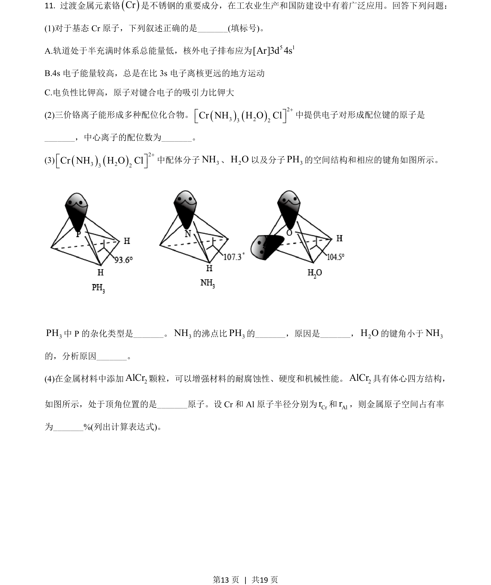
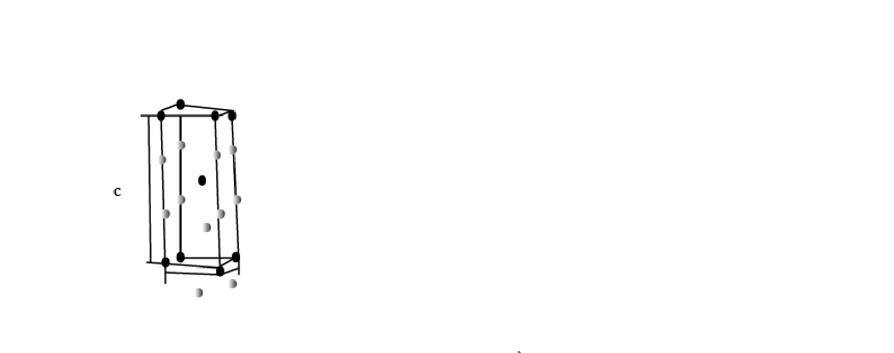
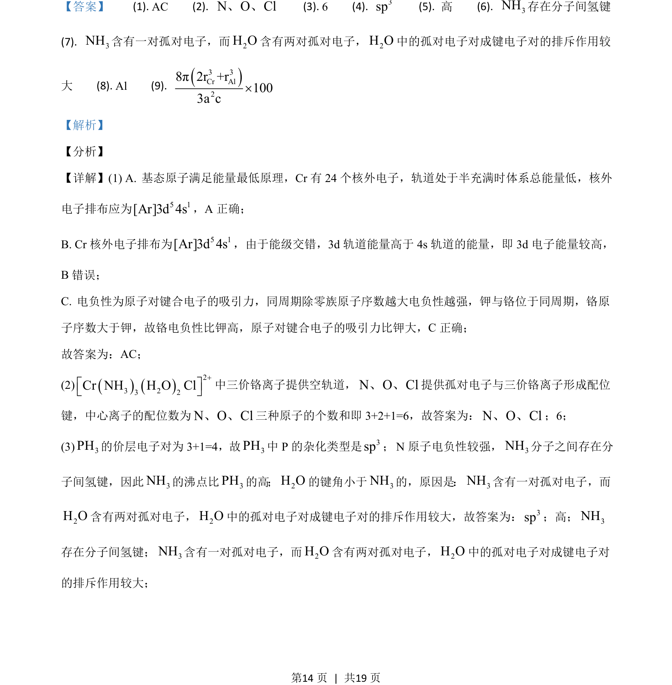
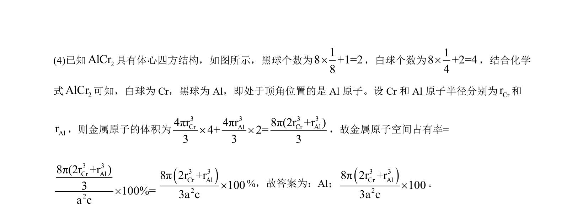

## 题面

## 摘要

考查基态Cr原子电子排布、配位化合物结构、分子性质比较及晶体空间占有率计算。

## 关联考点

- [[032-原子结构|核外电子排布]]
- [[440-配位键|配位键]]
- [[720-杂化轨道|杂化轨道]]
- [[702-晶胞计算|晶胞计算]]

## 答案与解析

> 📄 原 PDF 第 13 页：`素材/真题/吉林/2008-2024·（吉林）化学高考真题/2021年高考化学试卷（全国乙卷）（解析卷）.pdf`
