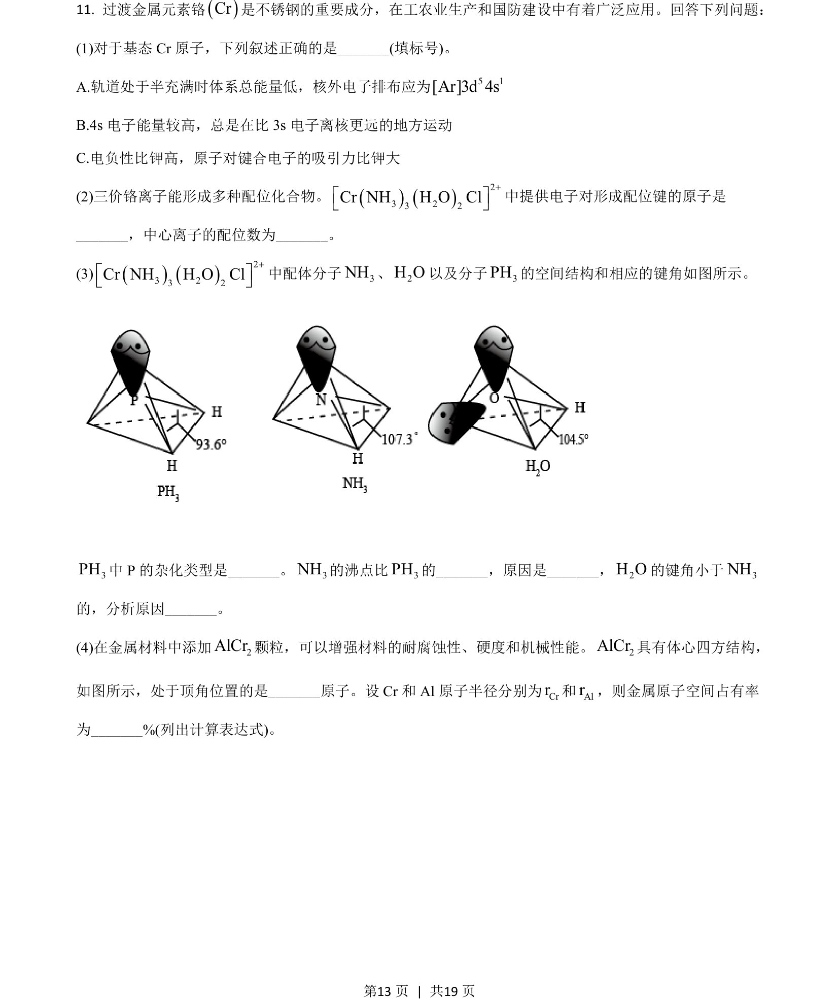
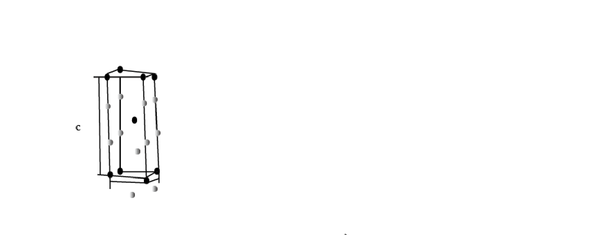
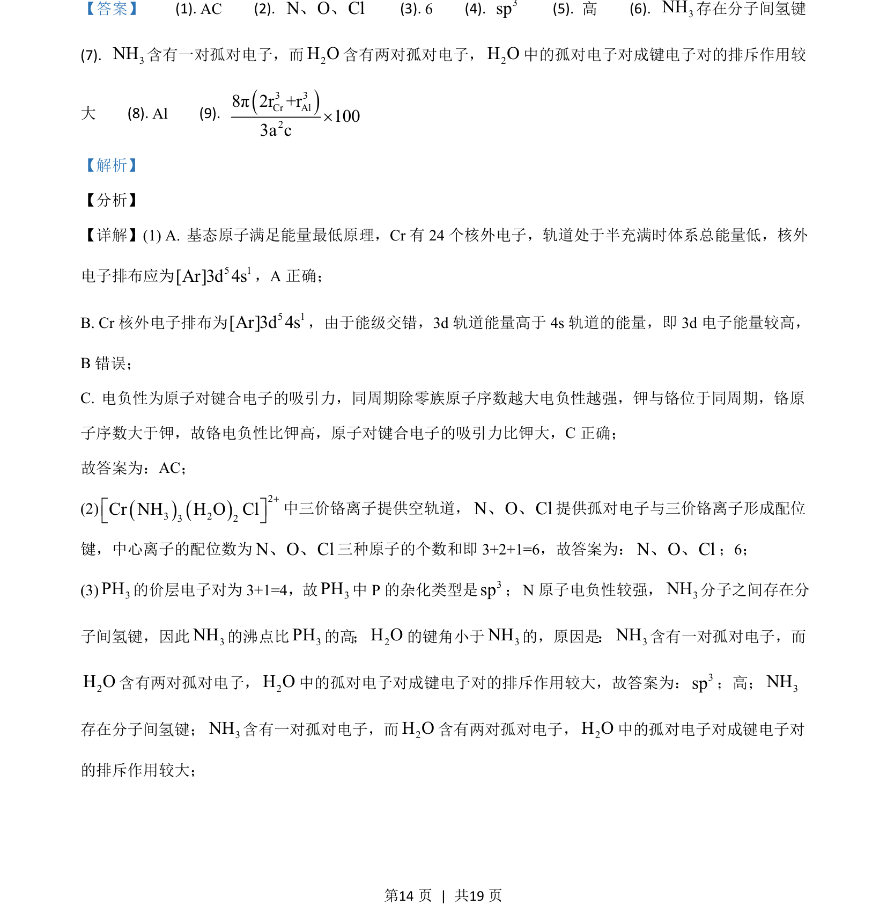
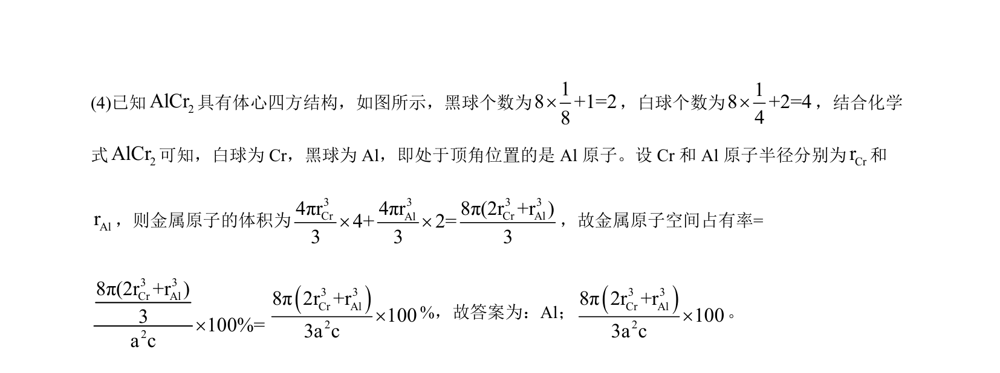

## 题面

## 摘要

考查基态Cr原子电子排布、配位化合物结构、分子性质比较及晶体空间占有率计算。

## 关联考点

- [[032-原子结构|核外电子排布]]
- [[440-配位键|配位键]]
- [[720-杂化轨道|杂化轨道]]
- [[702-晶胞计算|晶胞计算]]

## 答案与解析

> 📄 原 PDF 第 13 页：`素材/真题/吉林/2008-2024·（吉林）化学高考真题/2021年高考化学试卷（全国乙卷）（解析卷）.pdf`

<!-- 题干文本-start -->
## 题干文本
11. 过渡金属元素铬Cr是不锈钢的重要成分，在工农业生产和国防建设中有着广泛应用。回答下列问题：
(1)对于基态 Cr原子，下列叙述正确的是_______(填标号)。
A.轨道处于半充满时体系总能量低，核外电子排布应为 5 1[Ar]3d 4s
B.4s 电子能量较高，总是在比 3s 电子离核更远的地方运动
C.电负性比钾高，原子对键合电子的吸引力比钾大
(2)三价铬离子能形成多种配位化合物。23 23 2Cr NH H O Cl+é ùë û中提供电子对形成配位键的原子是
_______，中心离子的配位数为_______。
(3)23 23 2Cr NH H O Cl+é ùë û中配体分子3NH、2H O以及分子3PH的空间结构和相应的键角如图所示。
3PH中 P 的杂化类型是_______。3NH的沸点比3PH的_______，原因是_______，2H O的键角小于3NH
的，分析原因_______。
(4)在金属材料中添加2AlCr颗粒，可以增强材料的耐腐蚀性、硬度和机械性能。2AlCr具有体心四方结构，
如图所示，处于顶角位置的是_______原子。设 Cr 和 Al 原子半径分别为Crr和Alr，则金属原子空间占有率
为_______%(列出计算表达式)。
的
<!-- 题干文本-end -->

<!-- 解析文本-start -->
## 解析文本

<!-- 解析文本-end -->
