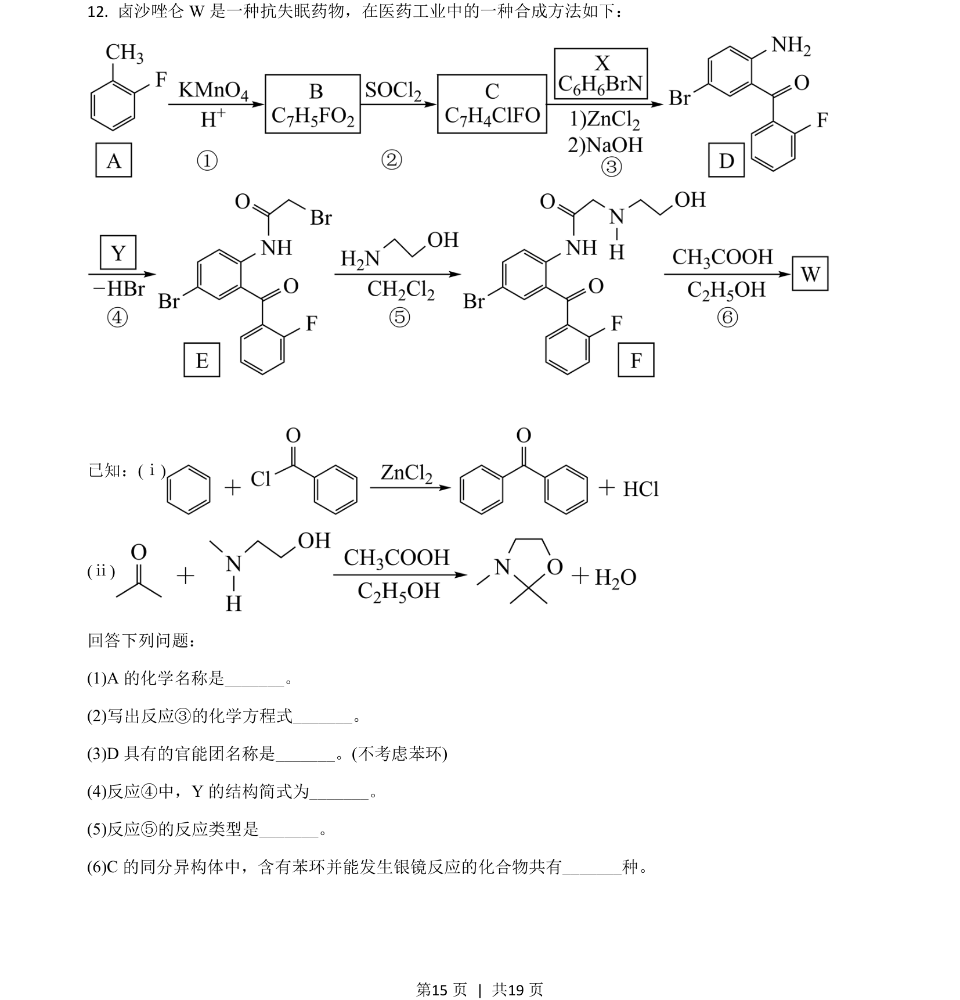

## 题面

## 摘要

本题考查有机合成路线推断，涉及物质命名、化学方程式书写、官能团识别、结构简式推断、反应类型判断及同分异构体数目的确定。

## 关联考点

- [[有机化学]]
- [[448-官能团|官能团]]
- [[446-同分异构体|同分异构体]]
- [[反应类型]]

## 答案与解析

> 📄 原 PDF 第 15 页：`素材/真题/吉林/2008-2024·（吉林）化学高考真题/2021年高考化学试卷（全国乙卷）（解析卷）.pdf`
