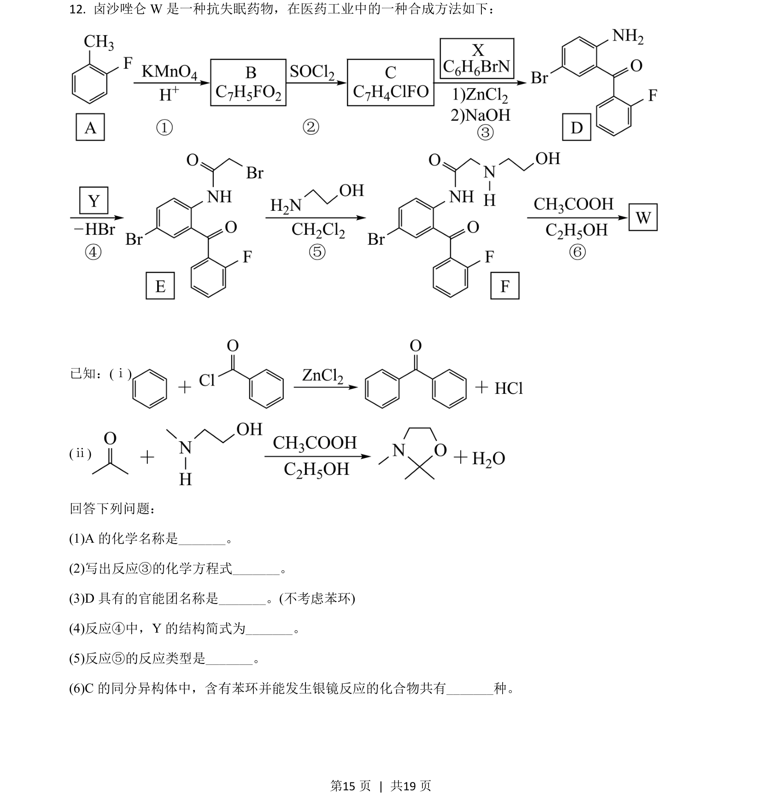
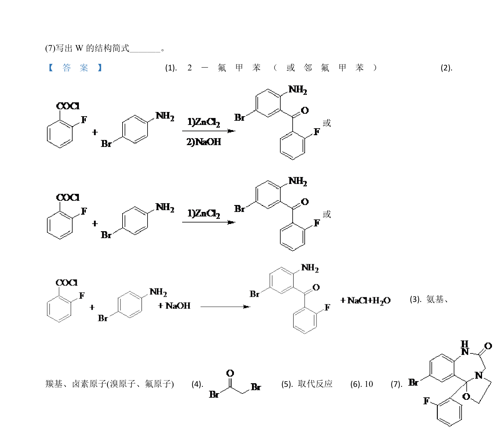
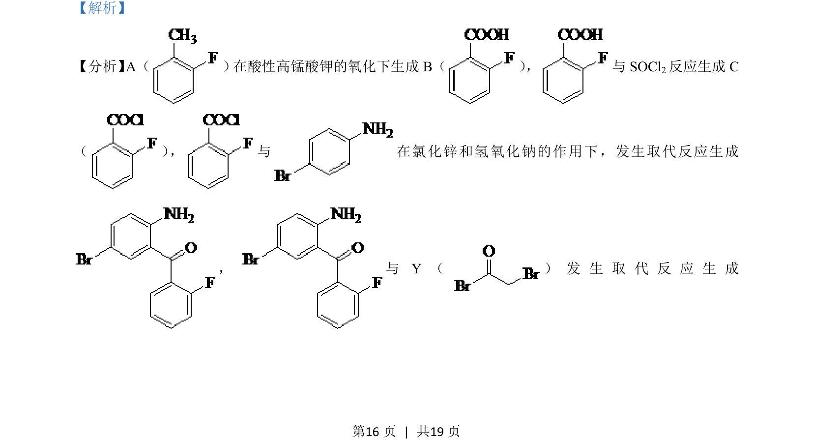
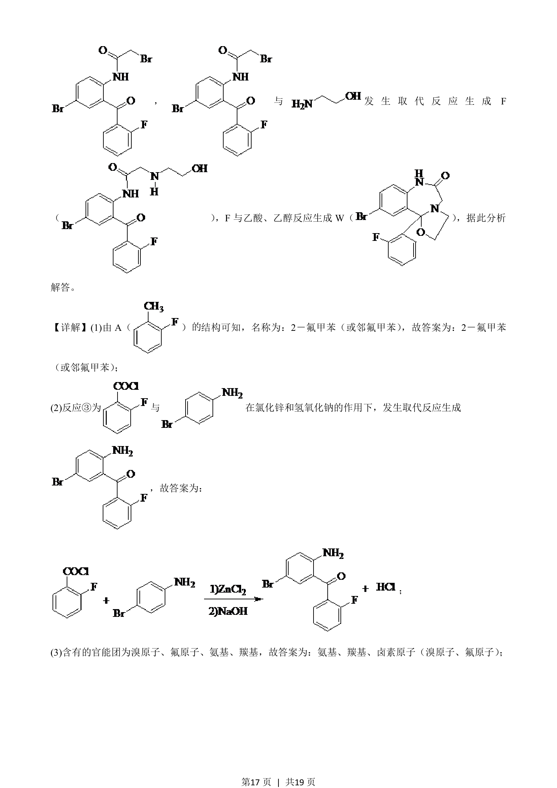
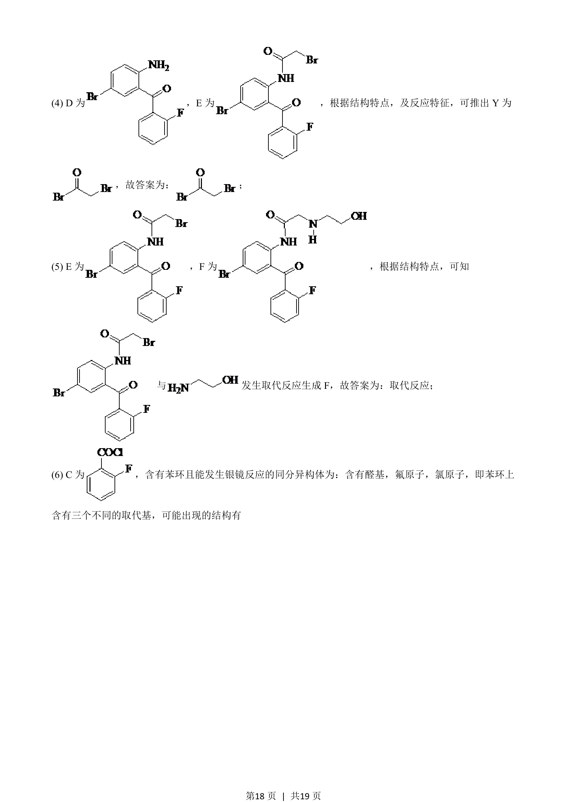
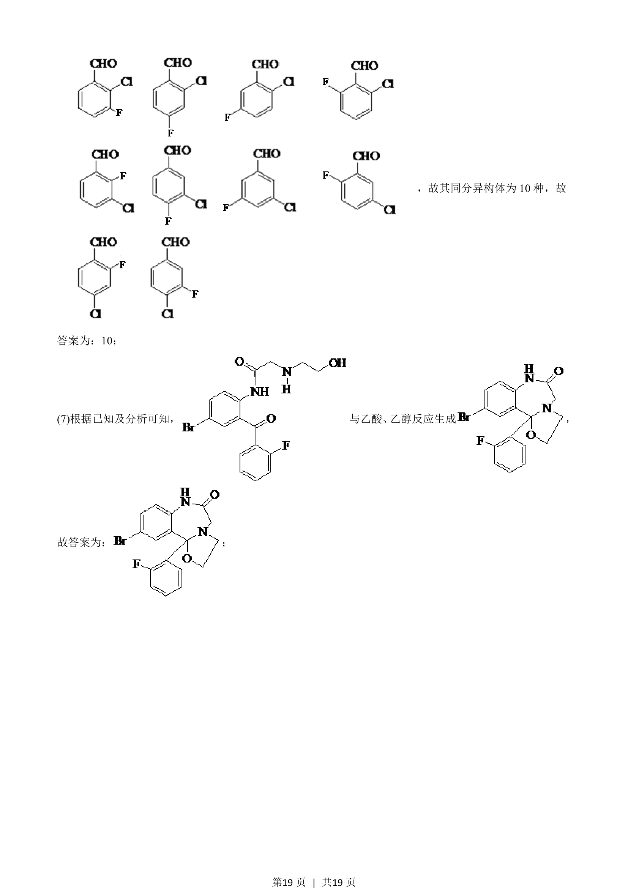

## 题面

## 摘要

本题考查有机合成路线推断，涉及物质命名、化学方程式书写、官能团识别、结构简式推断、反应类型判断及同分异构体数目的确定。

## 关联考点

- [[706-有机化学|有机化学]]
- [[448-官能团|官能团]]
- [[446-同分异构体|同分异构体]]
- [[646-反应类型|反应类型]]

## 答案与解析

> 📄 原 PDF 第 15 页：`素材/真题/吉林/2008-2024·（吉林）化学高考真题/2021年高考化学试卷（全国乙卷）（解析卷）.pdf`

<!-- 题干文本-start -->
## 题干文本
12. 卤沙唑仑 W是一种抗失眠药物，在医药工业中的一种合成方法如下：
已知：(ⅰ)
(ⅱ)
回答下列问题：
(1)A 的化学名称是_______。
(2)写出反应③的化学方程式_______。
(3)D 具有的官能团名称是_______。(不考虑苯环)
(4)反应④中，Y 的结构简式为_______。
(5)反应⑤的反应类型是_______。
(6)C 的同分异构体中，含有苯环并能发生银镜反应的化合物共有_______种。
<!-- 题干文本-end -->

<!-- 解析文本-start -->
## 解析文本

<!-- 解析文本-end -->
