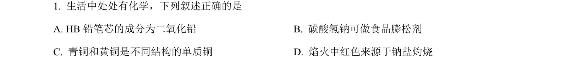
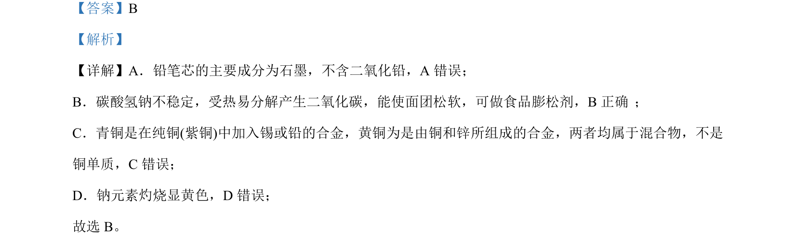

## 题面

## 摘要

本题通过判断常见物质成分与性质的正误，考查生活化学与基础元素化合物知识。

## 关联考点

- [[556-物质成分|物质成分]]
- [[562-碳酸氢钠性质|碳酸氢钠性质]]
- [[656-合金概念|合金概念]]
- [[205-焰色反应|焰色反应]]

## 答案与解析

> 📄 原 PDF 第 1 页：`素材/真题/吉林/2008-2024·（吉林）化学高考真题/2022年高考化学试卷（全国乙卷）（解析卷）.pdf`
