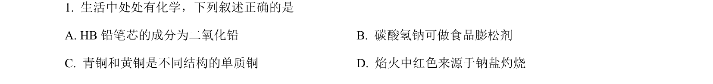
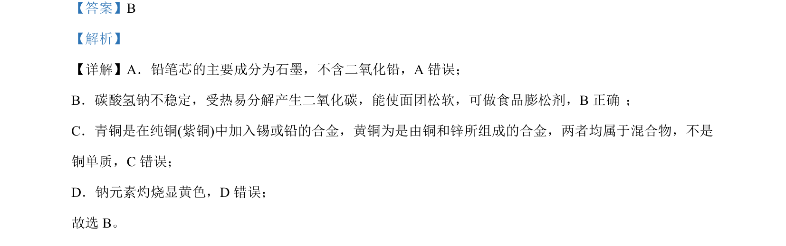

## 题面

## 摘要

本题通过判断常见物质成分与性质的正误，考查生活化学与基础元素化合物知识。

## 关联考点

- [[556-物质成分|物质成分]]
- [[562-碳酸氢钠性质|碳酸氢钠性质]]
- [[656-合金概念|合金概念]]
- [[205-焰色反应|焰色反应]]

## 答案与解析

> 📄 原 PDF 第 1 页：`素材/真题/吉林/2008-2024·（吉林）化学高考真题/2022年高考化学试卷（全国乙卷）（解析卷）.pdf`

<!-- 题干文本-start -->
## 题干文本
1. 生活中处处有化学，下列叙述正确的是
A. HB 铅笔芯的成分为二氧化铅 B. 碳酸氢钠可做食品膨松剂
C. 青铜和黄铜是不同结构的单质铜 D. 焰火中红色来源于钠盐灼烧
<!-- 题干文本-end -->

<!-- 解析文本-start -->
## 解析文本
【答案】B
【解析】
【详解】A．铅笔芯的主要成分为石墨，不含二氧化铅，A 错误；
B．碳酸氢钠不稳定，受热易分解产生二氧化碳，能使面团松软，可做食品膨松剂，B正确 ；
C．青铜是在纯铜(紫铜)中加入锡或铅的合金，黄铜为是由铜和锌所组成的合金，两者均属于混合物，不是
铜单质，C错误；
D．钠元素灼烧显黄色，D 错误；
故选 B。
<!-- 解析文本-end -->
