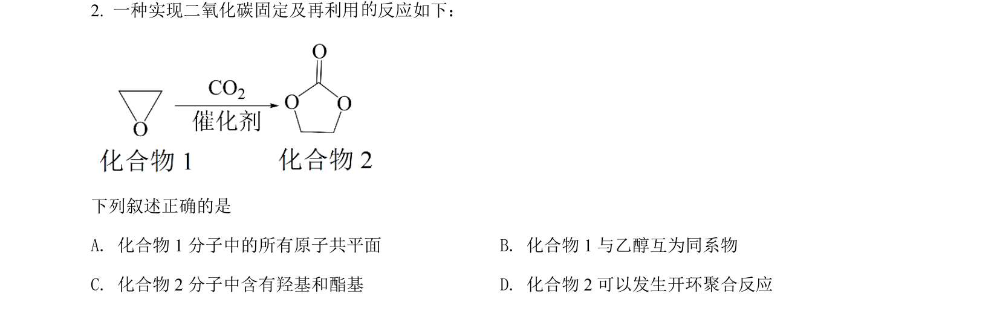
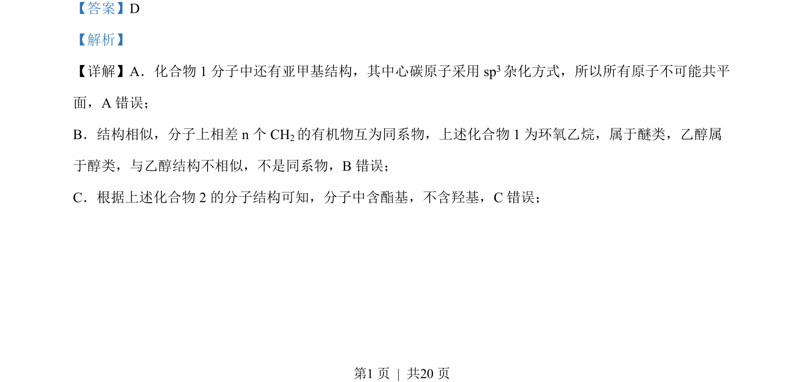
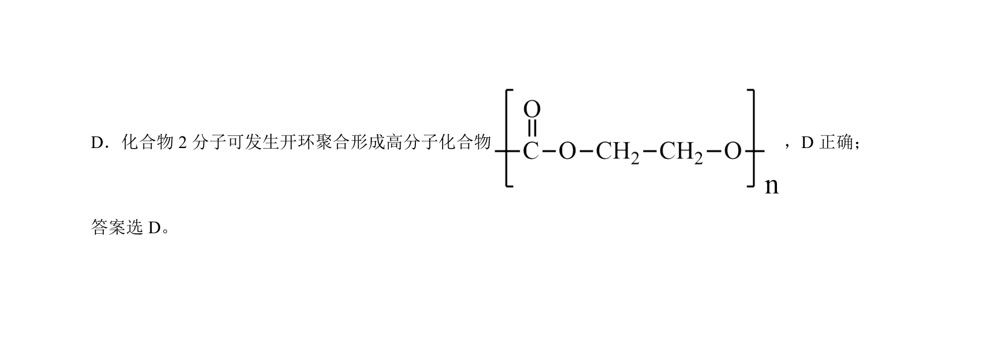

## 题面

## 摘要

该题通过判断有机物结构、官能团与性质关系，考查同系物、杂化方式等基本概念。

## 关联考点

- [[421-sp3杂化|sp3杂化]]
- [[658-同系物|同系物]]
- [[448-官能团|官能团]]
- [[824-聚合反应|聚合反应]]

## 答案与解析

> 📄 原 PDF 第 1 页：`素材/真题/吉林/2008-2024·（吉林）化学高考真题/2022年高考化学试卷（全国乙卷）（解析卷）.pdf`
