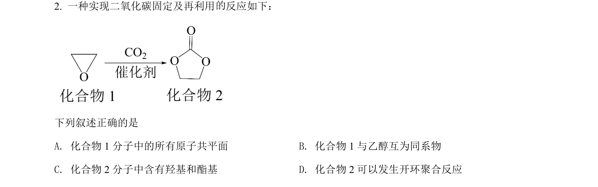
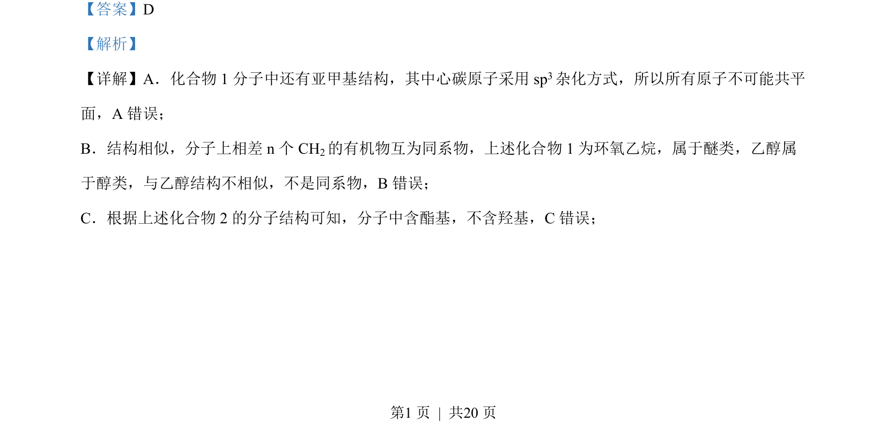
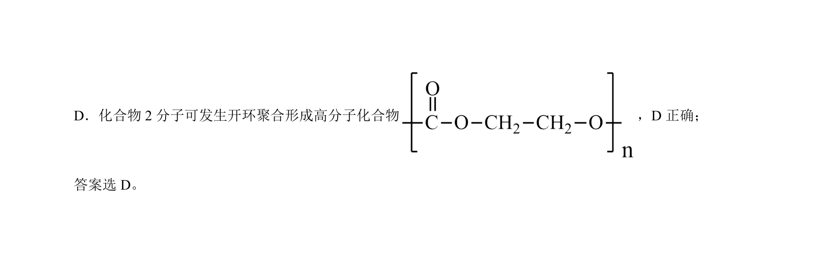

## 题面

## 摘要

该题通过判断有机物结构、官能团与性质关系，考查同系物、杂化方式等基本概念。

## 关联考点

- [[421-sp3杂化|sp3杂化]]
- [[658-同系物|同系物]]
- [[448-官能团|官能团]]
- [[824-聚合反应|聚合反应]]

## 答案与解析

> 📄 原 PDF 第 1 页：`素材/真题/吉林/2008-2024·（吉林）化学高考真题/2022年高考化学试卷（全国乙卷）（解析卷）.pdf`

<!-- 题干文本-start -->
## 题干文本
2. 一种实现二氧化碳固定及再利用 反应如下：
下列叙述正确的是
A. 化合物 1 分子中的所有原子共平面B. 化合物 1 与乙醇互为同系物
C. 化合物 2 分子中含有羟基和酯基D. 化合物 2 可以发生开环聚合反应
<!-- 题干文本-end -->

<!-- 解析文本-start -->
## 解析文本
【答案】D
【解析】
【详解】A．化合物 1 分子中还有亚甲基结构，其中心碳原子采用 sp3杂化方式，所以所有原子不可能共平
面，A 错误；
B．结构相似，分子上相差 n 个 CH2的有机物互为同系物，上述化合物 1 为环氧乙烷，属于醚类，乙醇属
于醇类，与乙醇结构不相似，不是同系物，B错误；
C．根据上述化合物 2 的分子结构可知，分子中含酯基，不含羟基，C错误；
的
<!-- 解析文本-end -->
