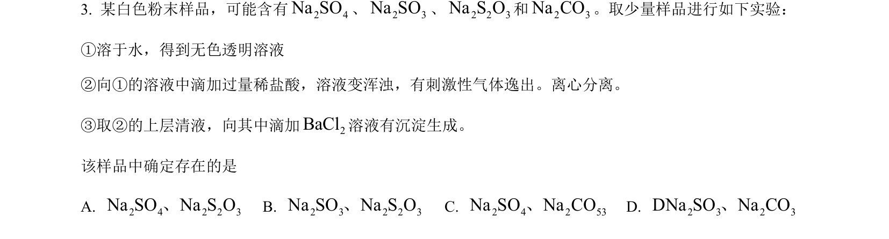
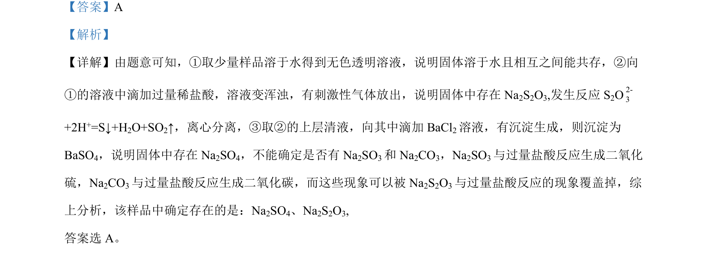

## 题面

## 摘要

该题考查物质鉴别，通过溶液反应现象推断样品中存在的离子或化合物。

## 关联考点

- [[169-离子反应|离子反应]]
- [[物质鉴别]]
- [[329-沉淀生成|沉淀生成]]
- [[气体检验]]

## 答案与解析

> 📄 原 PDF 第 2 页：`素材/真题/吉林/2008-2024·（吉林）化学高考真题/2022年高考化学试卷（全国乙卷）（解析卷）.pdf`
