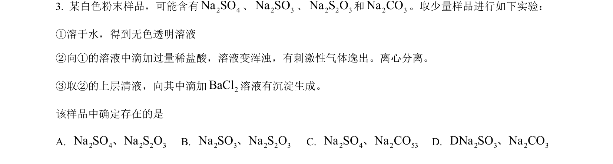
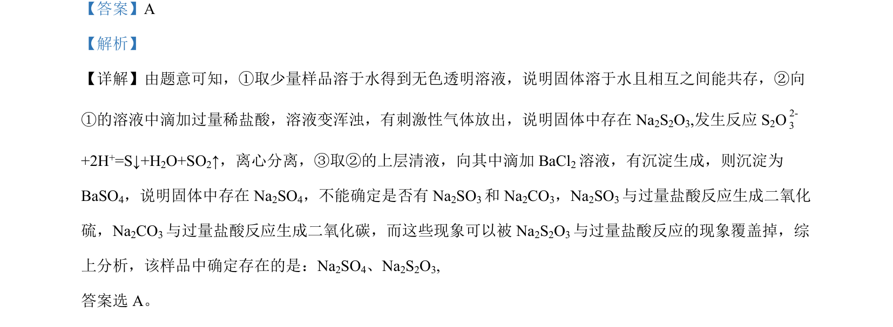

## 题面

## 摘要

该题考查物质鉴别，通过溶液反应现象推断样品中存在的离子或化合物。

## 关联考点

- [[169-离子反应|离子反应]]
- [[785-物质鉴别|物质鉴别]]
- [[329-沉淀生成|沉淀生成]]
- [[729-气体检验|气体检验]]

## 答案与解析

> 📄 原 PDF 第 2 页：`素材/真题/吉林/2008-2024·（吉林）化学高考真题/2022年高考化学试卷（全国乙卷）（解析卷）.pdf`

<!-- 题干文本-start -->
## 题干文本
3. 某白色粉末样品，可能含有2 4Na SO、2 3Na SO、2 2 3Na S O和2 3Na CO。取少量样品进行如下实验：
①溶于水，得到无色透明溶液
②向①的溶液中滴加过量稀盐酸，溶液变浑浊，有刺激性气体逸出。离心分离。
③取②的上层清液，向其中滴加2BaCl溶液有沉淀生成。
该样品中确定存在的是
A. 2 4 2 2 3Na SO Na S O、B. 2 3 2 2 3Na SO Na S O、C. 2 4 2 53Na SO Na CO、D. 2 3 2 3DNa SO Na CO、
<!-- 题干文本-end -->

<!-- 解析文本-start -->
## 解析文本
【答案】A
【解析】
【详解】由题意可知，①取少量样品溶于水得到无色透明溶液，说明固体溶于水且相互之间能共存，②向
①的溶液中滴加过量稀盐酸，溶液变浑浊，有刺激性气体放出，说明固体中存在 Na2S2O3,发生反应 S2O2-3
+2H+=S↓+H2O+SO2↑，离心分离，③取②的上层清液，向其中滴加 BaCl2溶液，有沉淀生成，则沉淀为
BaSO4，说明固体中存在 Na2SO4，不能确定是否有 Na2SO3和 Na2CO3，Na2SO3与过量盐酸反应生成二氧化
硫，Na2CO3与过量盐酸反应生成二氧化碳，而这些现象可以被 Na2S2O3与过量盐酸反应的现象覆盖掉，综
上分析，该样品中确定存在的是：Na2SO4、Na2S2O3,
答案选 A。
<!-- 解析文本-end -->
