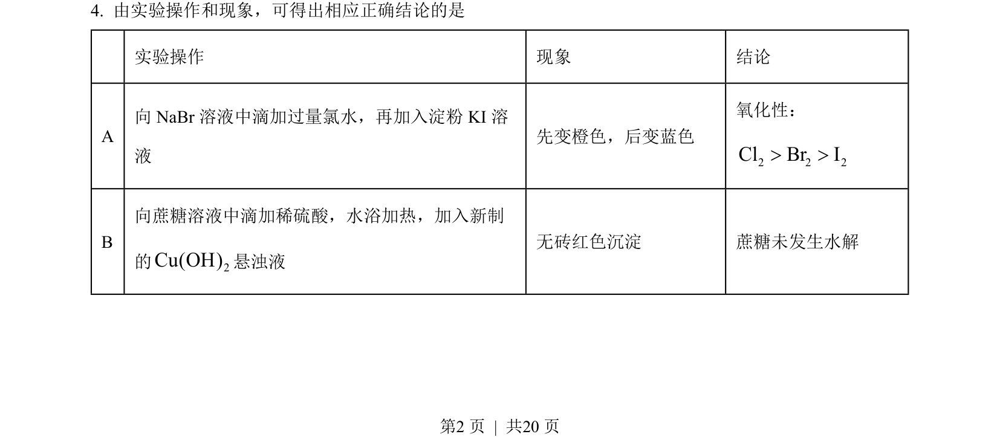
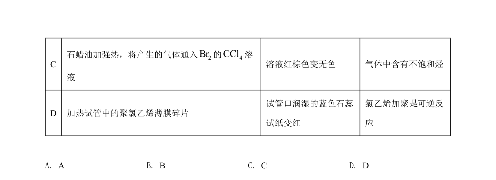
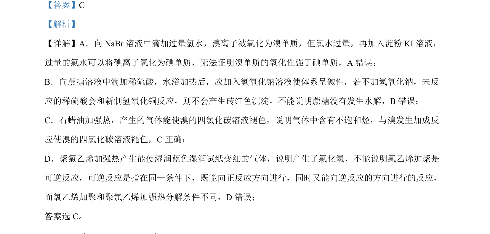

## 题面

## 摘要

本题考查化学实验方案设计与评价，涉及卤素氧化性比较、蔗糖水解产物检验、不饱和烃检验及可逆反应判断。

## 关联考点

- [[162-氧化还原反应|氧化还原反应]]
- [[757-淀粉碘化钾检验|淀粉碘化钾检验]]
- [[855-醛基检验|醛基检验]]
- [[233-乙烯加成反应|加成反应]]
- [[652-可逆反应条件|可逆反应条件]]

## 答案与解析

> 📄 原 PDF 第 2 页：`素材/真题/吉林/2008-2024·（吉林）化学高考真题/2022年高考化学试卷（全国乙卷）（解析卷）.pdf`
