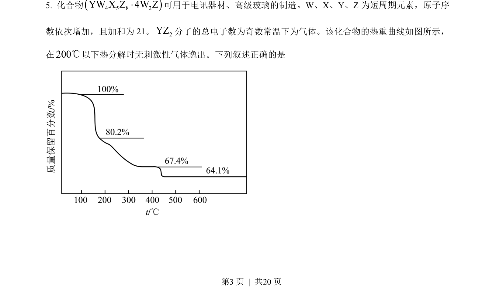
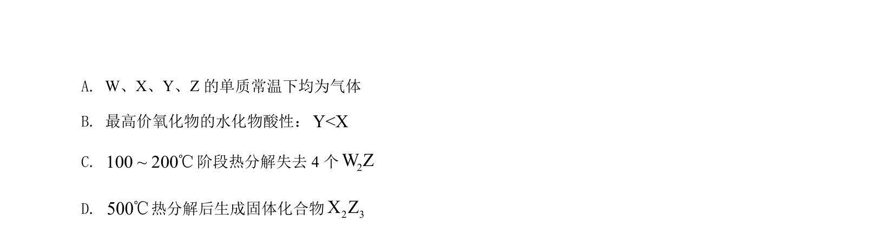
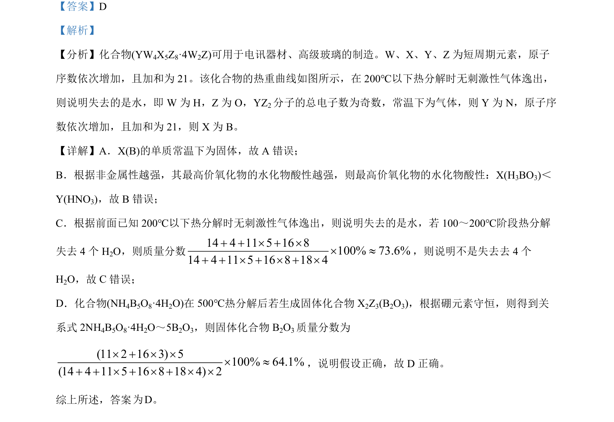

## 题面

## 摘要

本题通过热重曲线推断化合物组成，结合元素周期律和守恒计算判断选项正误。

## 关联考点

- [[597-元素推断|元素推断]]
- [[839-质量分数计算|质量分数计算]]
- [[662-守恒法|守恒法]]
- [[769-热重分析|热重分析]]

## 答案与解析

> 📄 原 PDF 第 3 页：`素材/真题/吉林/2008-2024·（吉林）化学高考真题/2022年高考化学试卷（全国乙卷）（解析卷）.pdf`
