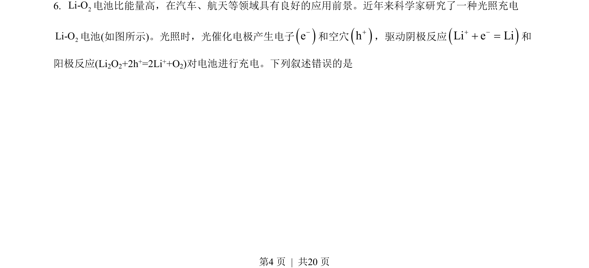
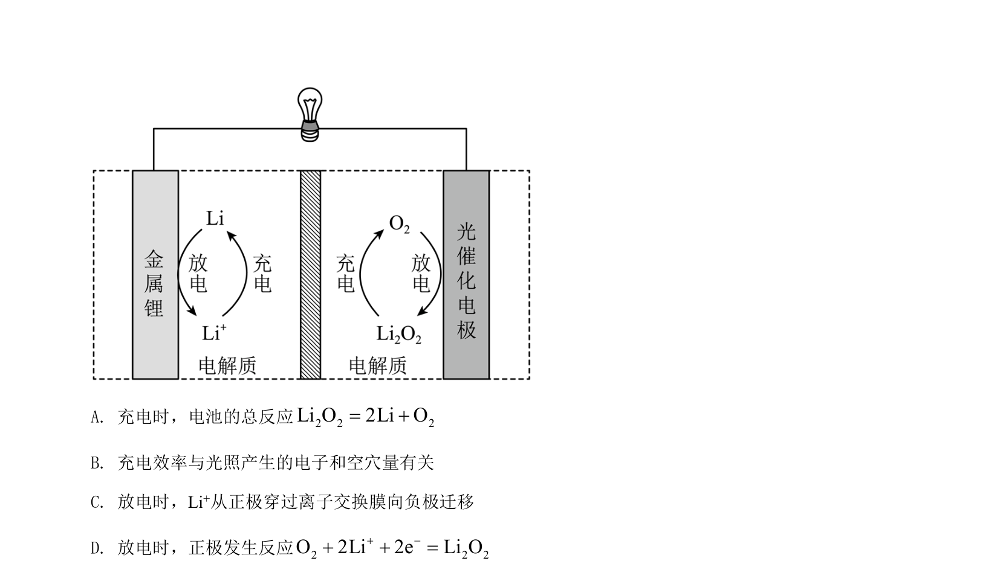
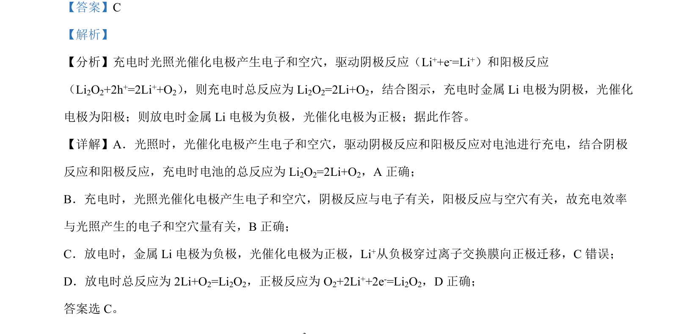

## 题面

## 摘要

本题考查锂氧电池充放电过程中的电极反应、总反应及离子迁移方向判断。

## 关联考点

- [[789-电化学|电化学]]
- [[793-电极反应|电极反应]]
- [[564-离子迁移|离子迁移]]
- [[599-充放电原理|充放电原理]]

## 答案与解析

> 📄 原 PDF 第 4 页：`素材/真题/吉林/2008-2024·（吉林）化学高考真题/2022年高考化学试卷（全国乙卷）（解析卷）.pdf`

<!-- 题干文本-start -->
## 题干文本
6. 2Li-O电池比能量高，在汽车、航天等领域具有良好的应用前景。近年来科学家研究了一种光照充电
2Li-O电池(如图所示)。光照时，光催化电极产生电子e-和空穴h+，驱动阴极反应Li e Li+ -+ =和
阳极反应(Li2O2+2h+=2Li++O2)对电池进行充电。下列叙述错误的是
为
<!-- 题干文本-end -->

<!-- 解析文本-start -->
## 解析文本

<!-- 解析文本-end -->
