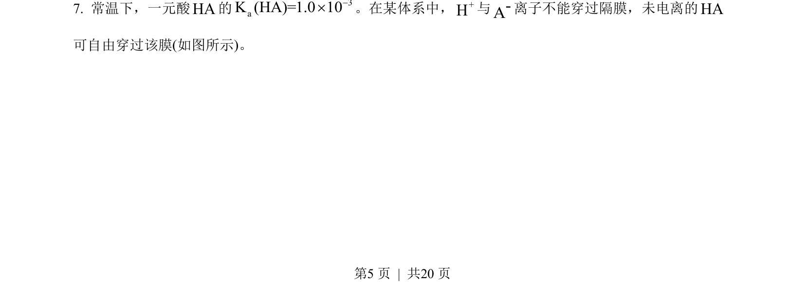
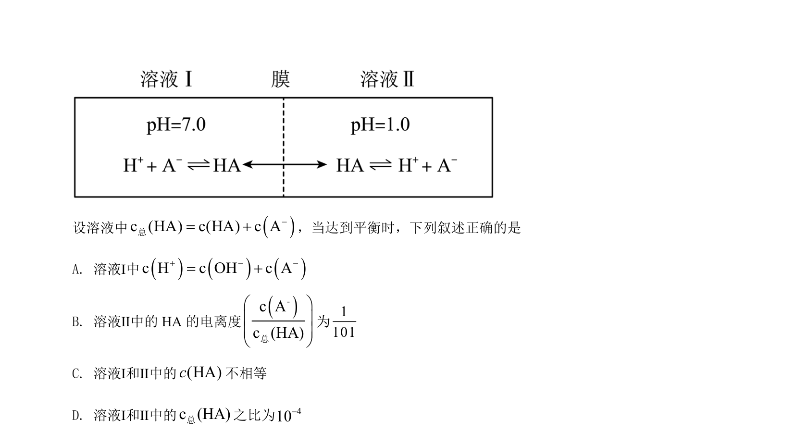
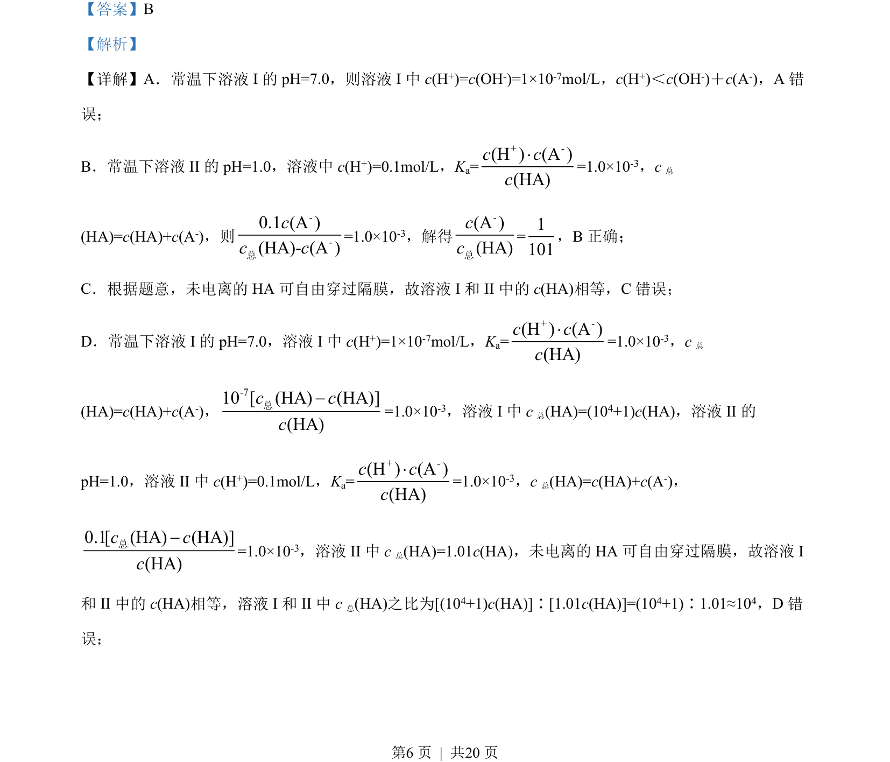

## 题面

## 摘要

考查弱酸电离平衡与隔膜扩散条件下溶液pH和粒子浓度关系的判断

## 关联考点

- [[334-电离平衡|电离平衡常数]]
- [[136-pH值|pH]]
- [[814-粒子浓度关系|粒子浓度关系]]
- [[865-隔膜扩散|隔膜扩散]]

## 答案与解析

> 📄 原 PDF 第 5 页：`素材/真题/吉林/2008-2024·（吉林）化学高考真题/2022年高考化学试卷（全国乙卷）（解析卷）.pdf`
