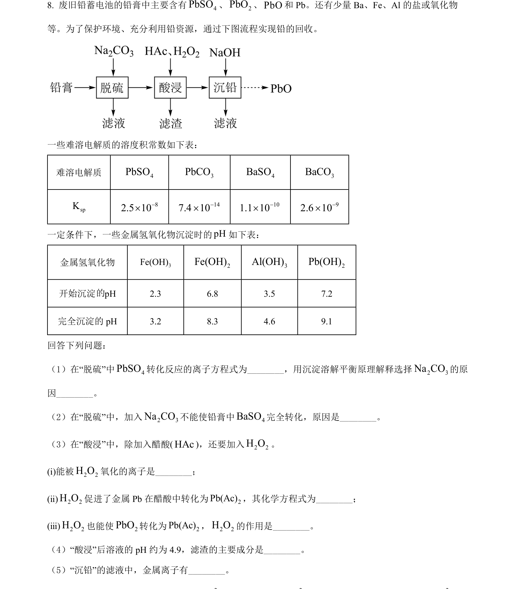
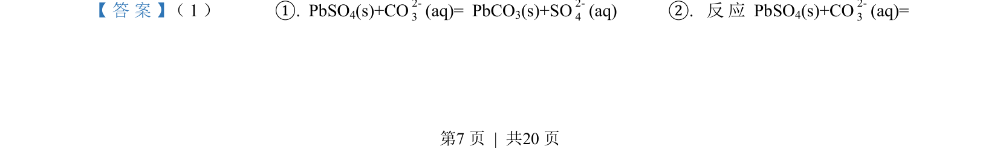
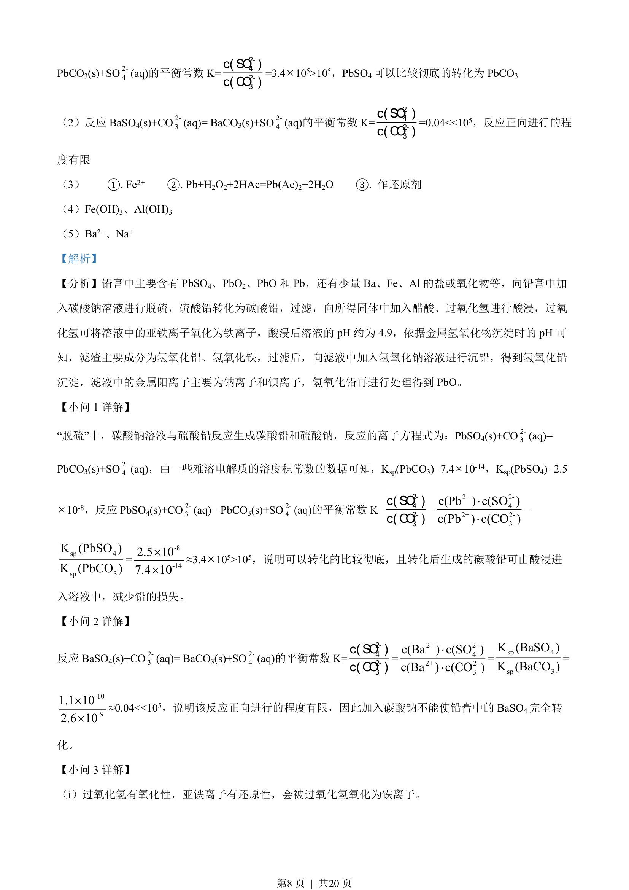
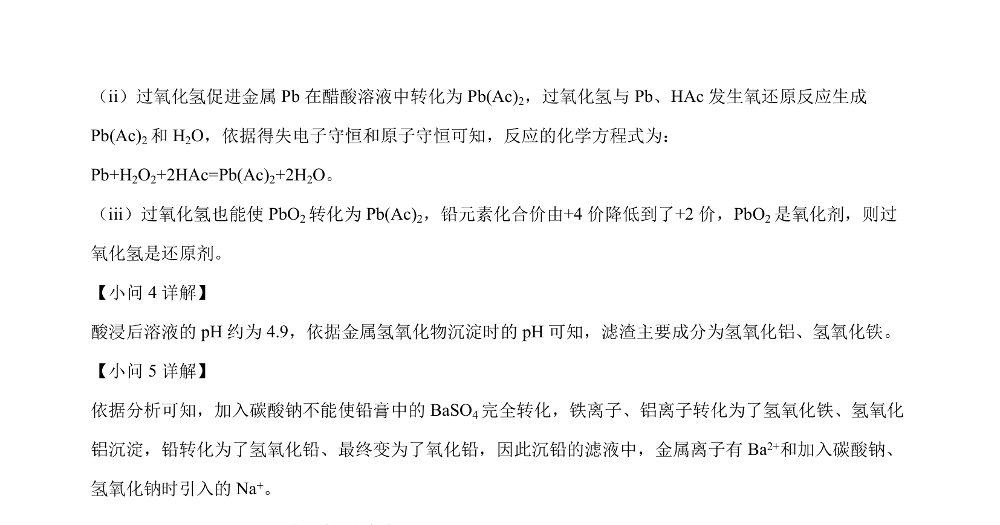

## 题面

## 摘要

考查铅膏回收流程中沉淀转化、氧化还原反应及pH条件控制

## 关联考点

- [[328-沉淀溶解平衡|沉淀溶解平衡]]
- [[762-溶度积|溶度积常数]]
- [[162-氧化还原反应|氧化还原反应]]
- [[809-离子沉淀pH|离子沉淀pH]]

## 答案与解析

> 📄 原 PDF 第 7 页：`素材/真题/吉林/2008-2024·（吉林）化学高考真题/2022年高考化学试卷（全国乙卷）（解析卷）.pdf`

<!-- 题干文本-start -->
## 题干文本
8. 废旧铅蓄电池的铅膏中主要含有 4PbSO、2PbO、PbO和 Pb。还有少量 Ba、Fe、Al 的盐或氧化物
等。为了保护环境、充分利用铅资源，通过下图流程实现铅的回收。
一些难溶电解质的溶度积常数如下表：
难溶电解质 4PbSO3PbCO4BaSO3BaCOspK82.5 10-´147.4 10-´101.1 10-´92.6 10-´
一定条件下，一些金属氢氧化物沉淀时的pH如下表：
金属氢氧化物 3Fe(OH)2Fe(OH)3Al(OH)2Pb(OH)
开始沉淀 pH 2.3 6.8 3.5 7.2
完全沉淀的 pH 3.2 8.3 4.6 9.1
回答下列问题：
（1）在“脱硫”中 4PbSO转化反应的离子方程式为________，用沉淀溶解平衡原理解释选择2 3Na CO的原
因________。
（2）在“脱硫”中，加入2 3Na CO不能使铅膏中 4BaSO完全转化，原因是________。
（3）在“酸浸”中，除加入醋酸(HAc)，还要加入2 2H O。
(ⅰ)能被2 2H O氧化的离子是________；
(ⅱ)2 2H O促进了金属 Pb 在醋酸中转化为 2Pb(Ac)，其化学方程式为________；
(ⅲ)2 2H O也能使2PbO转化为 2Pb(Ac)，2 2H O的作用是________。
（4）“酸浸”后溶液的 pH 约为 4.9，滤渣的主要成分是________。
（5）“沉铅”的滤液中，金属离子有________。
<!-- 题干文本-end -->

<!-- 解析文本-start -->
## 解析文本
【答案】 （1）     ①. PbSO 4(s)+CO2-3(aq)= PbCO 3(s)+SO2-4(aq)    ②. 反应 PbSO4(s)+CO2-3(aq)= 
的
<!-- 解析文本-end -->
