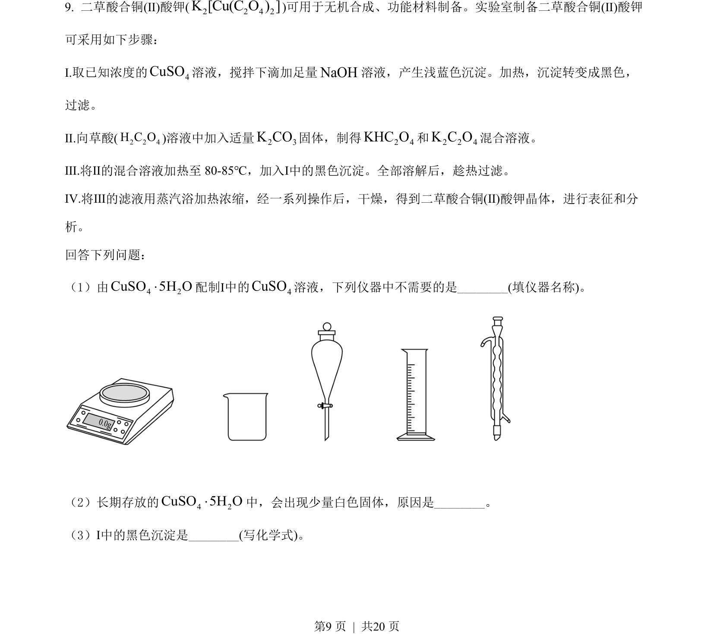
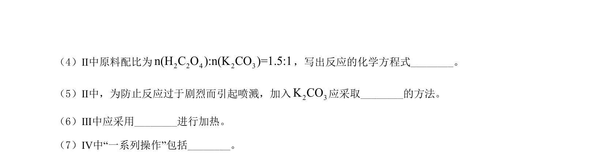
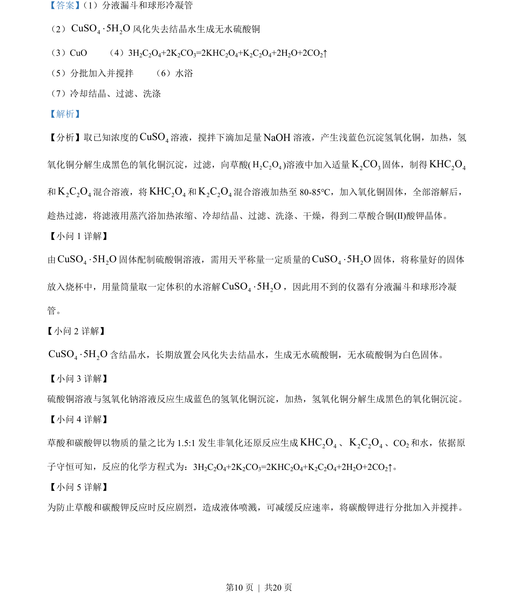
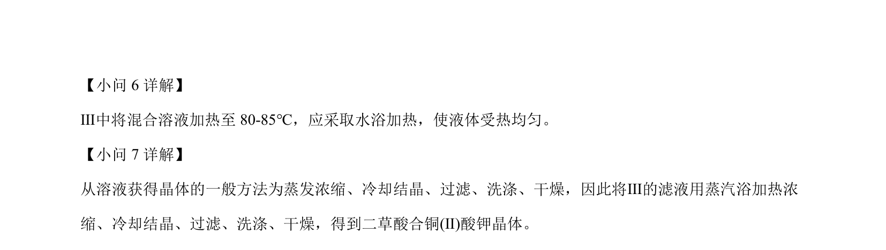

## 题面

## 摘要

制备二草酸合铜酸钾的化学实验步骤及操作分析

## 关联考点

- [[527-化学实验|化学实验]]
- [[838-试剂配制|试剂配制]]
- [[330-沉淀转化|沉淀转化]]

## 答案与解析

> 📄 原 PDF 第 9 页：`素材/真题/吉林/2008-2024·（吉林）化学高考真题/2022年高考化学试卷（全国乙卷）（解析卷）.pdf`

<!-- 题干文本-start -->
## 题干文本
9. 二草酸合铜(Ⅱ)酸钾(2 2 4 2]K Cu( O )[C)可用于无机合成、功能材料制备。实验室制备二草酸合铜(Ⅱ)酸钾
可采用如下步骤：
Ⅰ.取已知浓度的 4CuSO溶液，搅拌下滴加足量NaOH溶液，产生浅蓝色沉淀。加热，沉淀转变成黑色，
过滤。
Ⅱ.向草酸(2 2 4H C O)溶液中加入适量2 3K CO固体，制得2 4KHC O和2 2 4K C O混合溶液。
Ⅲ.将Ⅱ的混合溶液加热至 80-85℃，加入Ⅰ中的黑色沉淀。全部溶解后，趁热过滤。
Ⅳ.将Ⅲ的滤液用蒸汽浴加热浓缩，经一系列操作后，干燥，得到二草酸合铜(Ⅱ)酸钾晶体，进行表征和分
析。
回答下列问题：
（1）由 4 2CuSO 5H O×配制Ⅰ中的 4CuSO溶液，下列仪器中不需要的是________(填仪器名称)。
（2）长期存放的 4 2CuSO 5H O×中，会出现少量白色固体，原因是________。
（3）Ⅰ中的黑色沉淀是________(写化学式)。
<!-- 题干文本-end -->

<!-- 解析文本-start -->
## 解析文本

<!-- 解析文本-end -->
