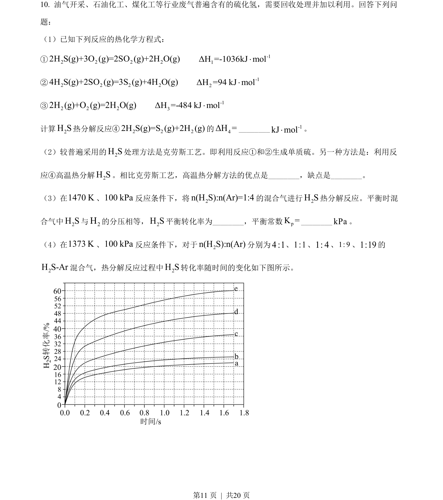
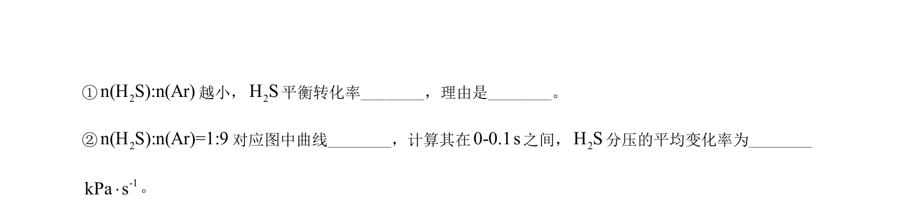
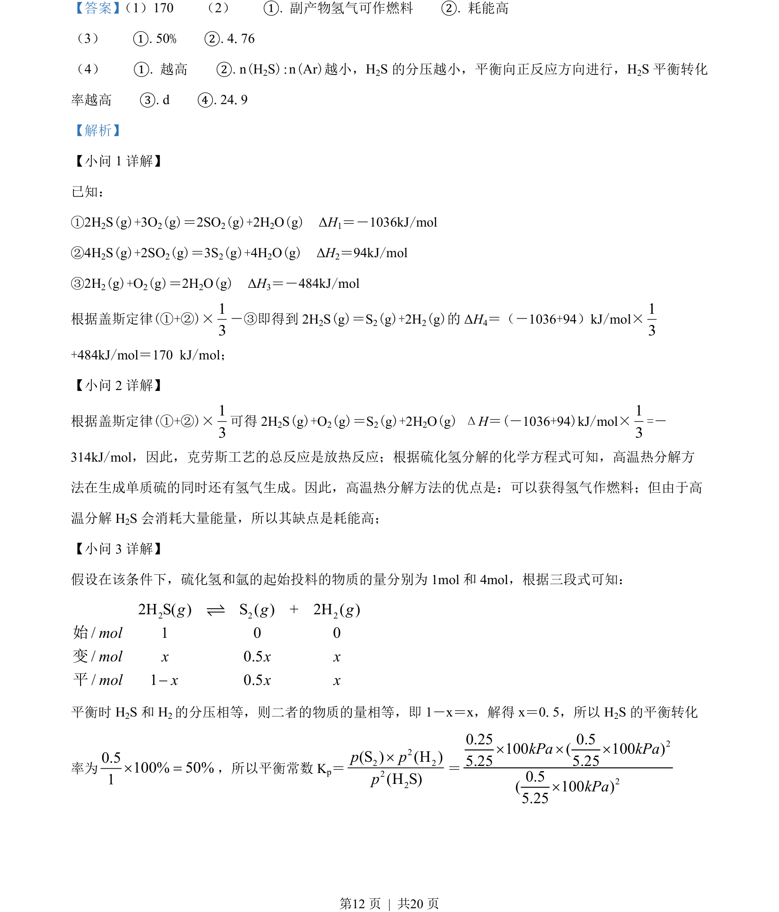
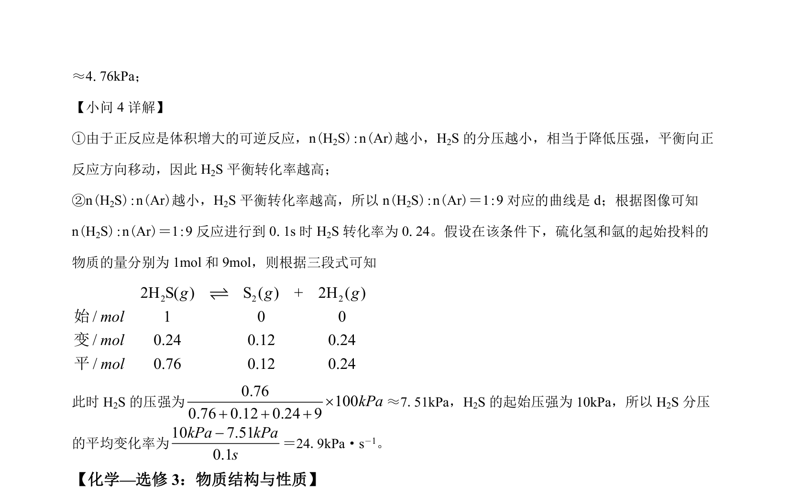

## 题面

## 摘要

该题以硫化氢回收处理为情境，考查热化学方程式计算、工艺评价、平衡转化率与平衡常数计算及图像分析。

## 关联考点

- [[768-热化学方程式与反应热计算|热化学方程式与反应热计算]]
- [[616-化学平衡及转化率计算|化学平衡及转化率计算]]
- [[615-化学工艺条件评价|化学工艺条件评价]]
- [[649-反应速率与平衡图像分析|反应速率与平衡图像分析]]

## 答案与解析

> 📄 原 PDF 第 11 页：`素材/真题/吉林/2008-2024·（吉林）化学高考真题/2022年高考化学试卷（全国乙卷）（解析卷）.pdf`
