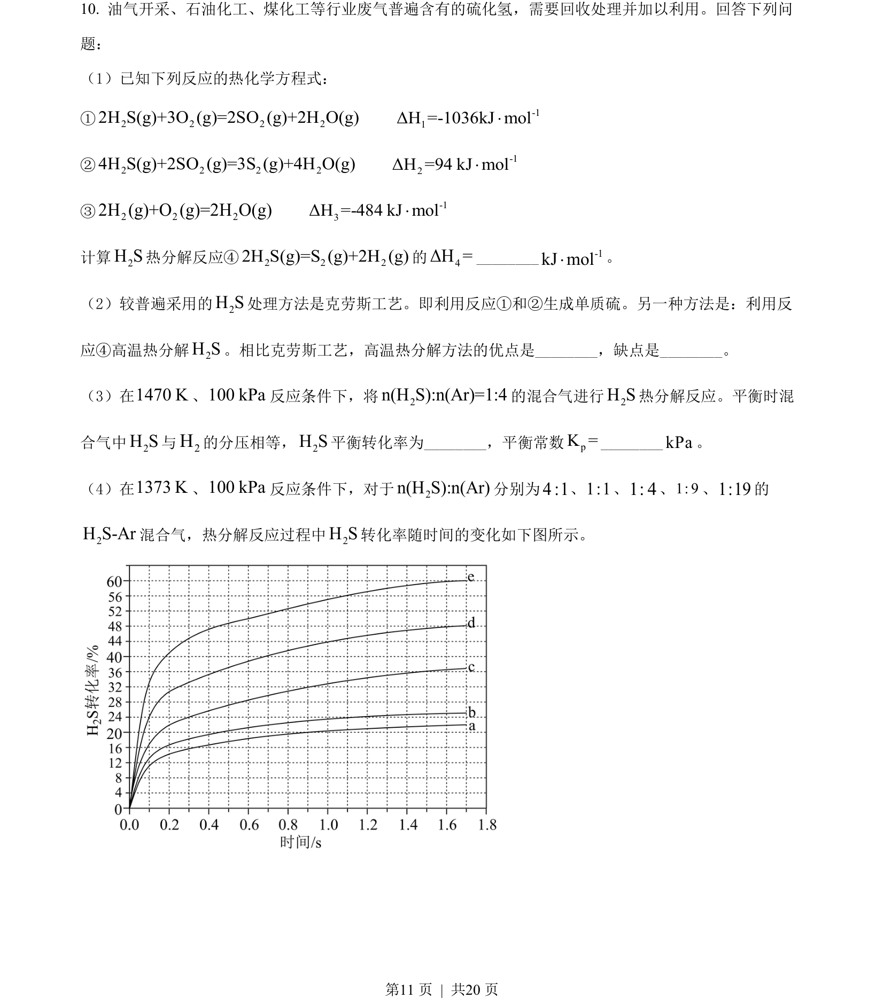
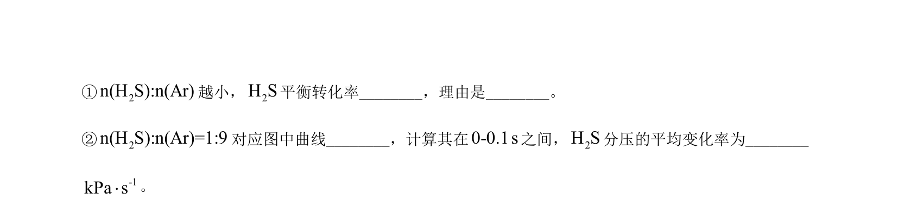
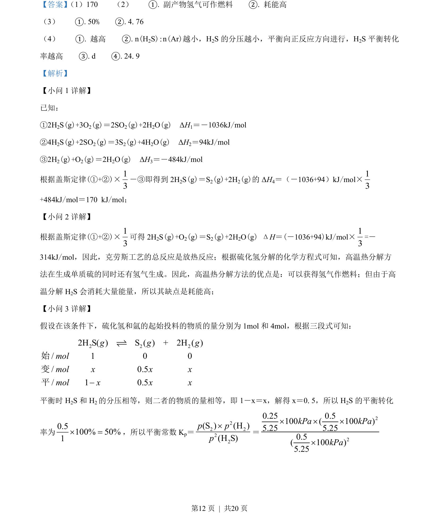
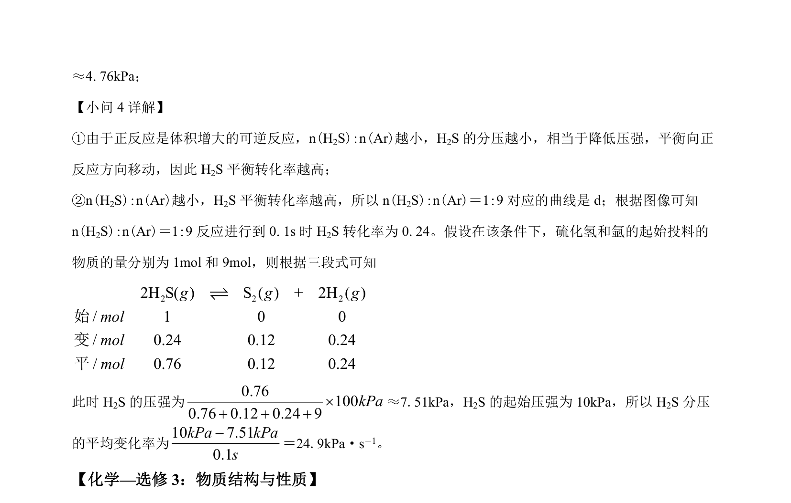

## 题面

## 摘要

该题以硫化氢回收处理为情境，考查热化学方程式计算、工艺评价、平衡转化率与平衡常数计算及图像分析。

## 关联考点

- [[768-热化学方程式与反应热计算|热化学方程式与反应热计算]]
- [[616-化学平衡及转化率计算|化学平衡及转化率计算]]
- [[615-化学工艺条件评价|化学工艺条件评价]]
- [[649-反应速率与平衡图像分析|反应速率与平衡图像分析]]

## 答案与解析

> 📄 原 PDF 第 11 页：`素材/真题/吉林/2008-2024·（吉林）化学高考真题/2022年高考化学试卷（全国乙卷）（解析卷）.pdf`

<!-- 题干文本-start -->
## 题干文本
10. 油气开采、石油化工、煤化工等行业废气普遍含有的硫化氢，需要回收处理并加以利用。回答下列问
题：
（1）已知下列反应的热化学方程式：
①2 2 2 22H S(g)+3O (g)=2SO (g)+2H O(g)    -11ΔH =-1036kJ mol×
②2 2 2 24H S(g)+2SO (g)=3S (g)+4H O(g)    -12ΔH =94 kJ mol×
③2 2 22H (g)+O (g)=2H O(g)    -13ΔH =-484 kJ mol×
计算2H S热分解反应④ 2 222H S(g)=S (g)+2H (g)的4ΔH =________ -1kJ mol×。
（2）较普遍采用的2H S处理方法是克劳斯工艺。即利用反应①和②生成单质硫。另一种方法是：利用反
应④高温热分解2H S。相比克劳斯工艺，高温热分解方法的优点是________，缺点是________。
（3）在1470 K、100 kPa反应条件下，将2n(H S):n(Ar)=1:4的混合气进行2H S热分解反应。平衡时混
合气中2H S与2H的分压相等，2H S平衡转化率为________，平衡常数pK =________kPa。
（4）在1373 K、100 kPa反应条件下，对于2n(H S):n(Ar)分别为4 :1、1:1、1: 4、1: 9、1:19的
2H S-Ar混合气，热分解反应过程中2H S转化率随时间的变化如下图所示。
<!-- 题干文本-end -->

<!-- 解析文本-start -->
## 解析文本

<!-- 解析文本-end -->
