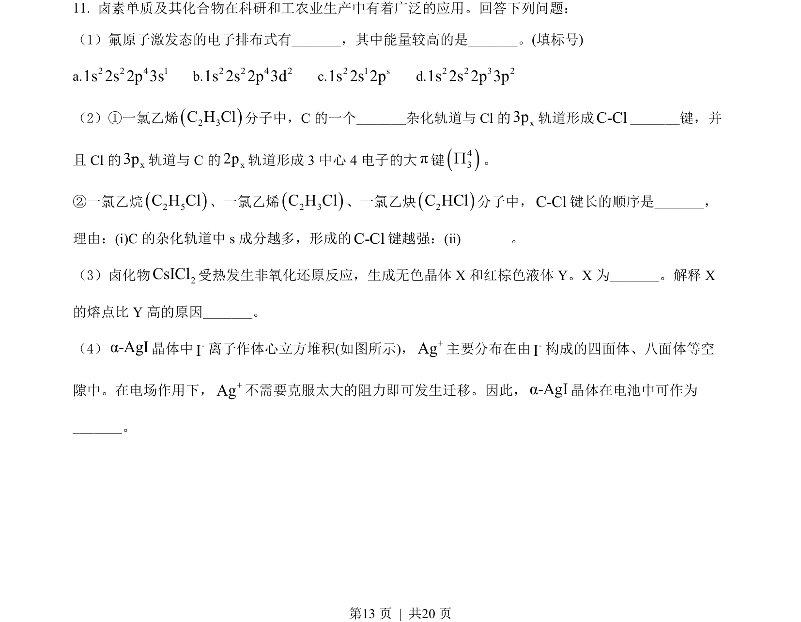
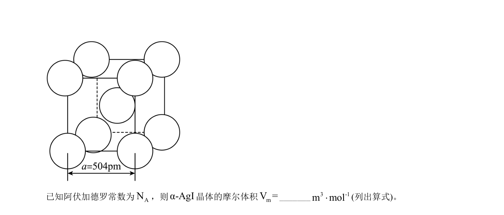
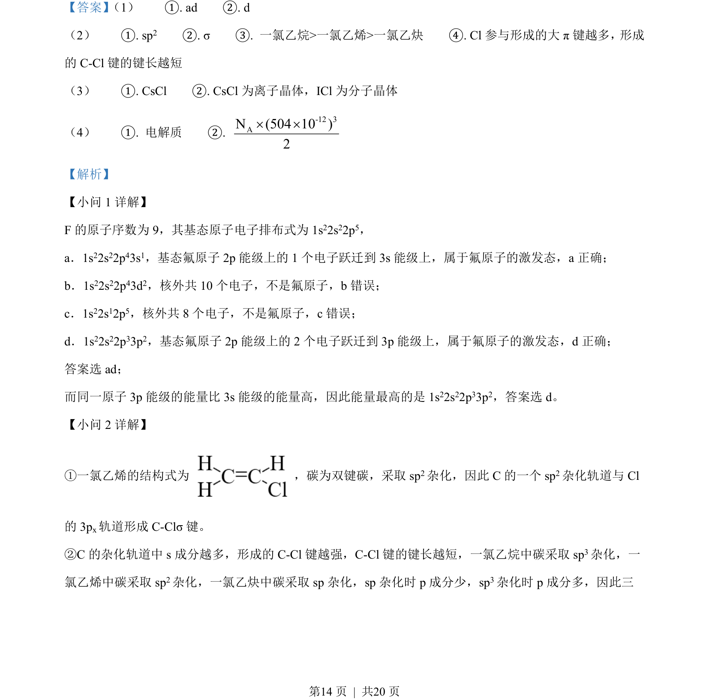
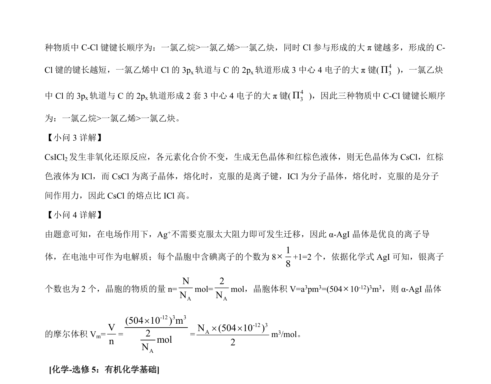

## 题面

## 摘要

考查氟原子激发态能量、C-Cl键长比较、晶体类型与熔点判断及晶胞摩尔体积计算。

## 关联考点

- [[638-原子激发态|原子激发态]]
- [[721-杂化轨道|杂化轨道]]
- [[444-键长|键长]]
- [[809-离子晶体与分子晶体|离子晶体与分子晶体]]
- [[703-晶胞计算|晶胞计算]]

## 答案与解析

> 📄 原 PDF 第 13 页：`素材/真题/吉林/2008-2024·（吉林）化学高考真题/2022年高考化学试卷（全国乙卷）（解析卷）.pdf`
