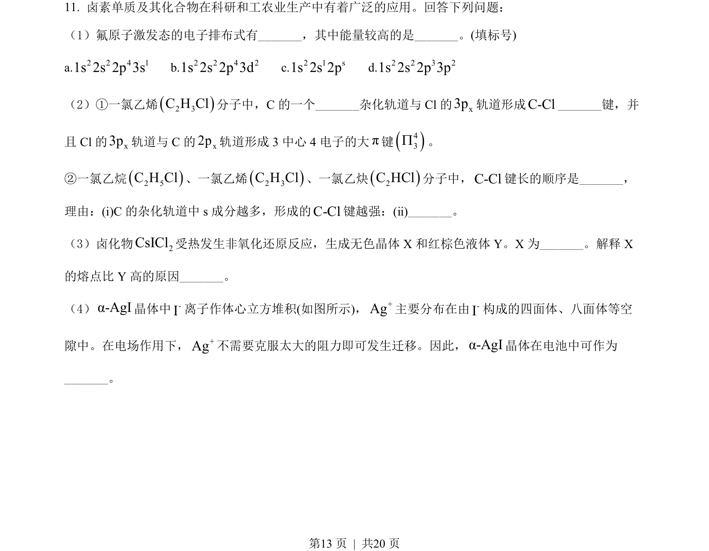
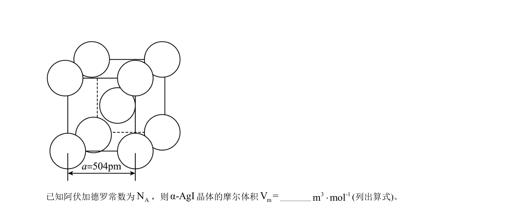
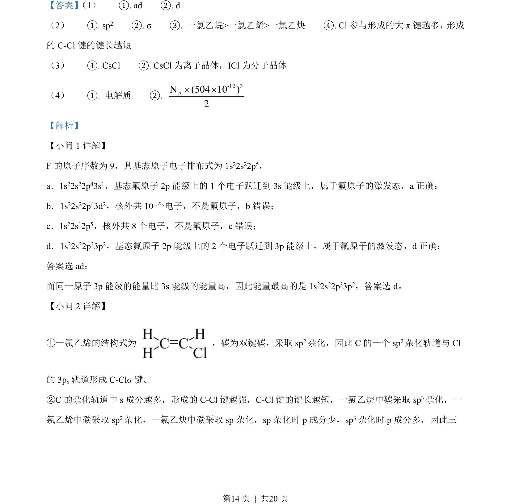
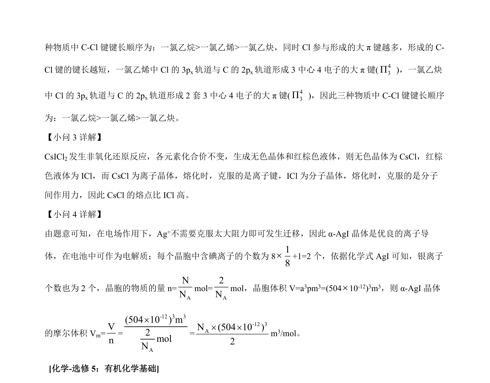

## 题面

## 摘要

考查氟原子激发态能量、C-Cl键长比较、晶体类型与熔点判断及晶胞摩尔体积计算。

## 关联考点

- [[637-原子激发态|原子激发态]]
- [[720-杂化轨道|杂化轨道]]
- [[444-键长|键长]]
- [[808-离子晶体与分子晶体|离子晶体与分子晶体]]
- [[702-晶胞计算|晶胞计算]]

## 答案与解析

> 📄 原 PDF 第 13 页：`素材/真题/吉林/2008-2024·（吉林）化学高考真题/2022年高考化学试卷（全国乙卷）（解析卷）.pdf`

<!-- 题干文本-start -->
## 题干文本
11. 卤素单质及其化合物在科研和工农业生产中有着广泛的应用。回答下列问题：
（1）氟原子激发态的电子排布式有_______，其中能量较高的是_______。(填标号)
a.2 2 4 11s 2s 2p 3s    b.2 2 4 21s 2s 2p 3d    c.2 1 s1s 2s 2p    d.2 2 3 21s 2s 2p 3p
（2）①一氯乙烯2 3C H Cl分子中，C的一个_______杂化轨道与 Cl的x3p轨道形成C-Cl_______键，并
且 Cl的x3p轨道与 C的x2p轨道形成 3 中心 4 电子的大π键43P。
②一氯乙烷2 5C H Cl、一氯乙烯2 3C H Cl、一氯乙炔2C HCl分子中，C-Cl键长的顺序是_______，
理由：(ⅰ)C的杂化轨道中 s 成分越多，形成的C-Cl键越强：(ⅱ)_______。
（3）卤化物 2CsICl受热发生非氧化还原反应，生成无色晶体 X 和红棕色液体 Y。X 为_______。解释 X
的熔点比 Y 高的原因_______。
（4）α-AgI晶体中-I离子作体心立方堆积(如图所示)，+Ag主要分布在由-I构成的四面体、八面体等空
隙中。在电场作用下，+Ag不需要克服太大的阻力即可发生迁移。因此，α-AgI晶体在电池中可作为
_______。
<!-- 题干文本-end -->

<!-- 解析文本-start -->
## 解析文本

<!-- 解析文本-end -->
