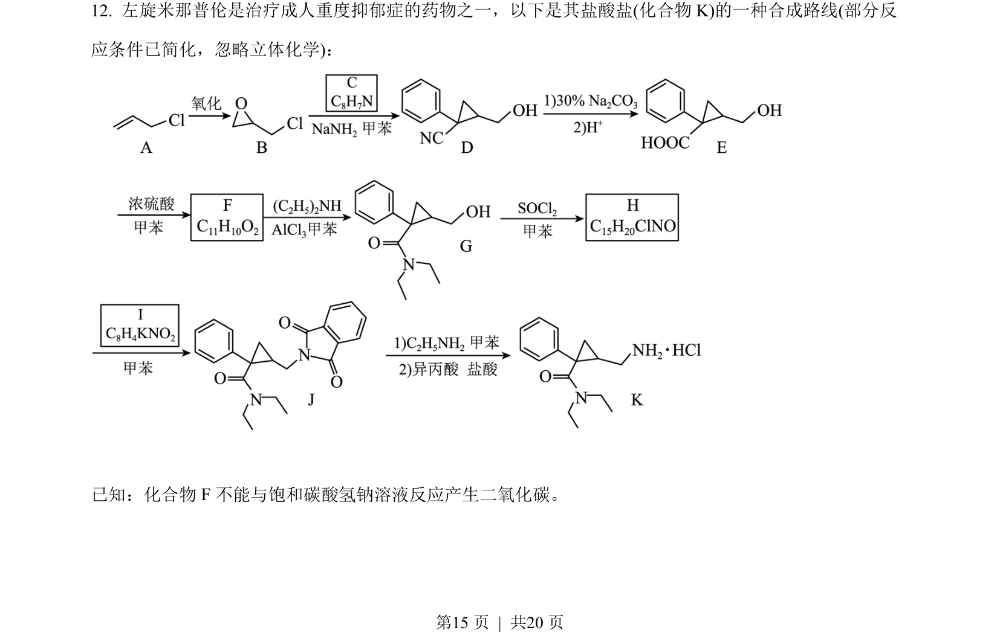

## 题面

## 摘要

该题考查有机合成路线中结构简式与反应类型的推断能力，要求根据给定信息推求中间产物及最终物质。

## 关联考点

- [[有机合成推断]]
- [[结构简式分析]]
- [[反应类型判断]]
- [[分子式确定]]

## 答案与解析

> 📄 原 PDF 第 15 页：`素材/真题/吉林/2008-2024·（吉林）化学高考真题/2022年高考化学试卷（全国乙卷）（解析卷）.pdf`
