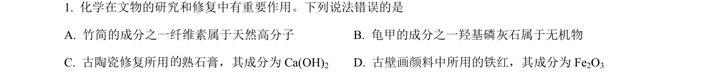
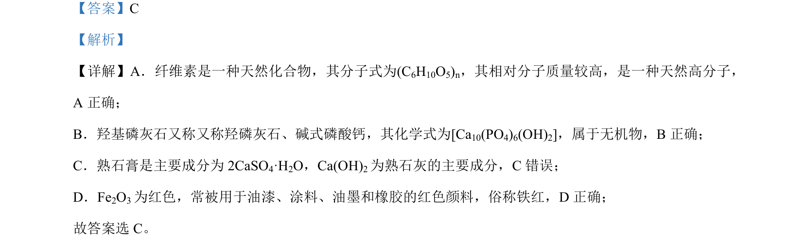

## 题面

## 摘要

本题考查常见物质的组成、化学式与俗名的正误判断。

## 关联考点

- [[164-物质分类|物质分类]]
- [[029-化学式|化学式]]
- [[127-无机物|无机物]]
- [[天然高分子]]

## 答案与解析

> 📄 原 PDF 第 1 页：`素材/真题/吉林/2008-2024·（吉林）化学高考真题/2023年高考化学试卷（新课标）（解析卷）.pdf`
