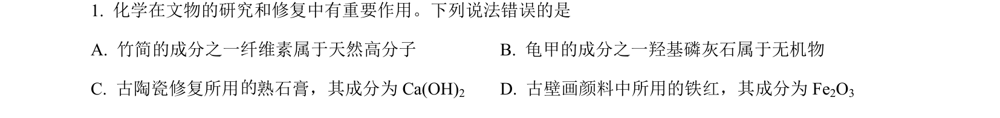
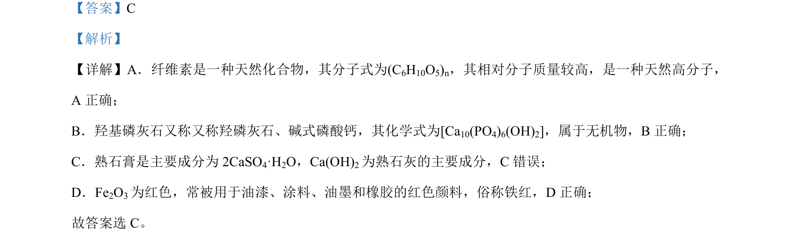

## 题面

## 摘要

本题考查常见物质的组成、化学式与俗名的正误判断。

## 关联考点

- [[164-物质分类|物质分类]]
- [[029-化学式|化学式]]
- [[127-无机物|无机物]]
- [[538-天然高分子|天然高分子]]

## 答案与解析

> 📄 原 PDF 第 1 页：`素材/真题/吉林/2008-2024·（吉林）化学高考真题/2023年高考化学试卷（新课标）（解析卷）.pdf`

<!-- 题干文本-start -->
## 题干文本
1. 化学在文物的研究和修复中有重要作用。下列说法错误的是
A. 竹简的成分之一纤维素属于天然高分子 B. 龟甲的成分之一羟基磷灰石属于无机物
C. 古陶瓷修复所用 熟石膏，其成分为 Ca(OH)2 D. 古壁画颜料中所用的铁红，其成分为 Fe2O3
<!-- 题干文本-end -->

<!-- 解析文本-start -->
## 解析文本
【答案】C
【解析】
【详解】A．纤维素是一种天然化合物，其分子式为(C6H10O5)n，其相对分子质量较高，是一种天然高分子，
A 正确；
B．羟基磷灰石又称又称羟磷灰石、碱式磷酸钙，其化学式为[Ca10(PO4)6(OH)2]，属于无机物，B正确；
C．熟石膏是主要成分为 2CaSO4·H2O，Ca(OH)2为熟石灰的主要成分，C错误；
D．Fe2O3为红色，常被用于油漆、涂料、油墨和橡胶的红色颜料，俗称铁红，D 正确；
故答案选 C。
<!-- 解析文本-end -->
