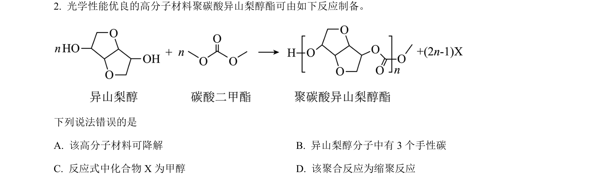
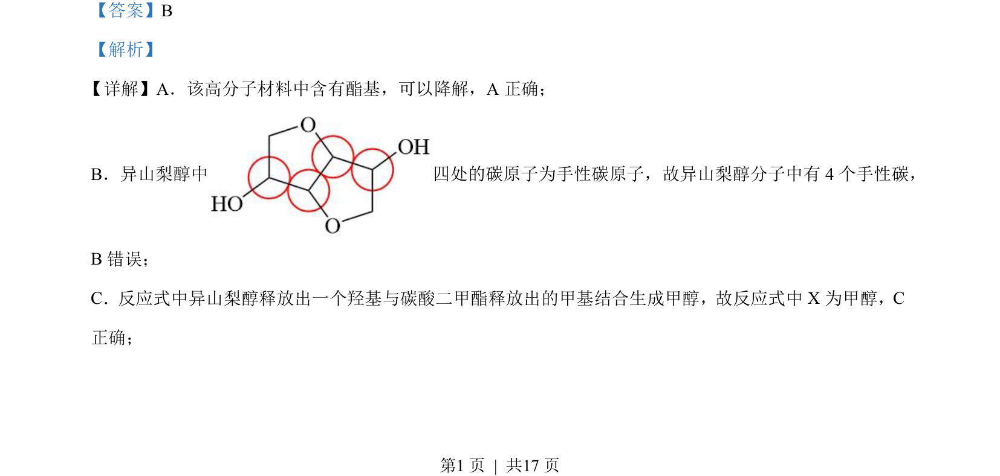
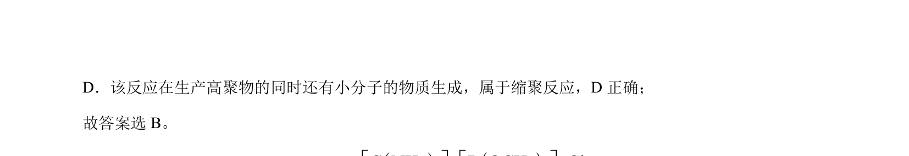

## 题面

## 摘要

该题考查高分子材料结构与性质，涉及手性碳判断、反应类型及产物分析。

## 关联考点

- [[692-手性碳|手性碳]]
- [[500-缩聚反应|缩聚反应]]
- [[850-酯基降解|酯基降解]]

## 答案与解析

> 📄 原 PDF 第 1 页：`素材/真题/吉林/2008-2024·（吉林）化学高考真题/2023年高考化学试卷（新课标）（解析卷）.pdf`
