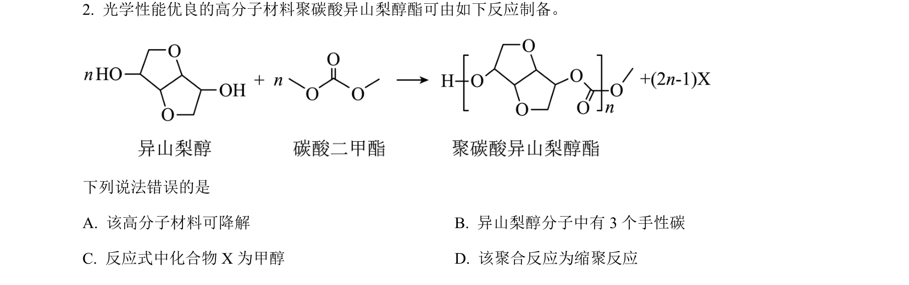
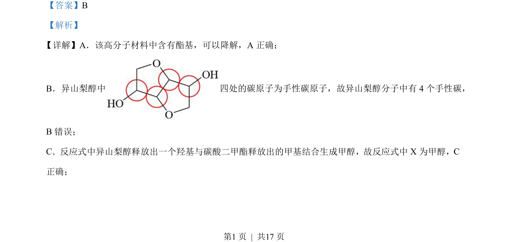
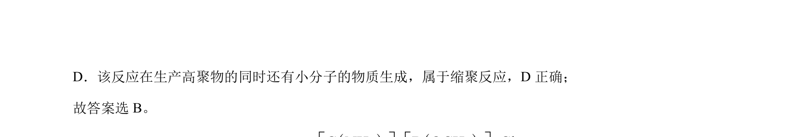

## 题面

## 摘要

该题考查高分子材料结构与性质，涉及手性碳判断、反应类型及产物分析。

## 关联考点

- [[692-手性碳|手性碳]]
- [[500-缩聚反应|缩聚反应]]
- [[850-酯基降解|酯基降解]]

## 答案与解析

> 📄 原 PDF 第 1 页：`素材/真题/吉林/2008-2024·（吉林）化学高考真题/2023年高考化学试卷（新课标）（解析卷）.pdf`

<!-- 题干文本-start -->
## 题干文本
2. 光学性能优良的高分子材料聚碳酸异山梨醇酯可由如下反应制备。
下列说法错误的是
A. 该高分子材料可降解 B. 异山梨醇分子中有 3 个手性碳
C. 反应式中化合物 X 为甲醇 D. 该聚合反应为缩聚反应
<!-- 题干文本-end -->

<!-- 解析文本-start -->
## 解析文本
【答案】B
【解析】
详解】A．该高分子材料中含有酯基，可以降解，A 正确；
B．异山梨醇中 四处的碳原子为手性碳原子，故异山梨醇分子中有 4 个手性碳，
B错误；
C．反应式中异山梨醇释放出一个羟基与碳酸二甲酯释放出的甲基结合生成甲醇，故反应式中X 为甲醇，C
正确；
的
【
<!-- 解析文本-end -->
