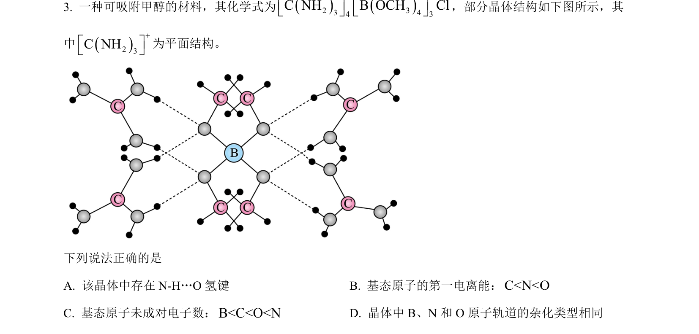
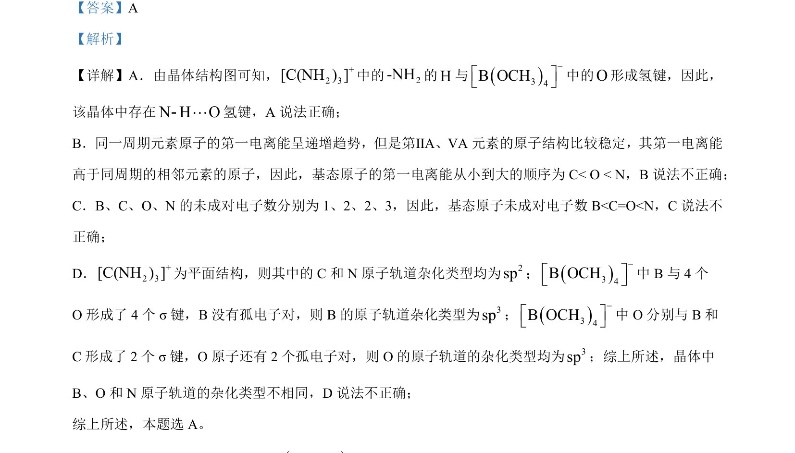

## 题面

## 摘要

该题考查晶体中氢键判断、第一电离能顺序、未成对电子数比较及原子轨道杂化类型。

## 关联考点

- [[435-氢键|氢键]]
- [[393-第一电离能|第一电离能]]
- [[719-未成对电子数|未成对电子数]]
- [[902-原子轨道杂化|原子轨道杂化]]

## 答案与解析

> 📄 原 PDF 第 2 页：`素材/真题/吉林/2008-2024·（吉林）化学高考真题/2023年高考化学试卷（新课标）（解析卷）.pdf`
