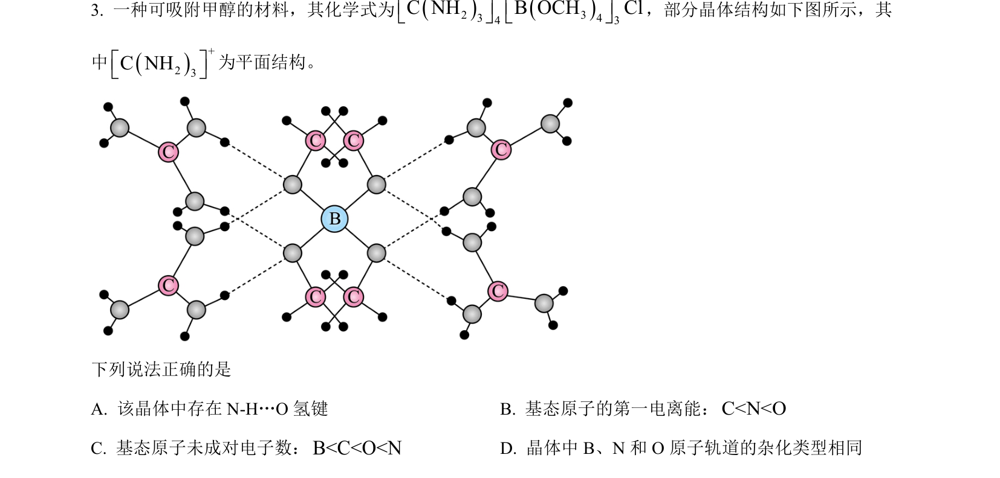
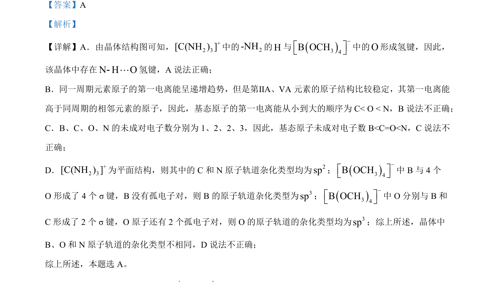

## 题面

## 摘要

该题考查晶体中氢键判断、第一电离能顺序、未成对电子数比较及原子轨道杂化类型。

## 关联考点

- [[435-氢键|氢键]]
- [[393-第一电离能|第一电离能]]
- [[718-未成对电子数|未成对电子数]]
- [[901-原子轨道杂化|原子轨道杂化]]

## 答案与解析

> 📄 原 PDF 第 2 页：`素材/真题/吉林/2008-2024·（吉林）化学高考真题/2023年高考化学试卷（新课标）（解析卷）.pdf`

<!-- 题干文本-start -->
## 题干文本
3. 一种可吸附甲醇的材料，其化学式为2 33 434C NH B OCH Clé ùé ùë ûë û，部分晶体结构如下图所示，其
中+23C NHé ùë û为平面结构。
   
下列说法正确的是
A. 该晶体中存在 N-H…O 氢键 B. 基态原子的第一电离能：C<N<O
C. 基态原子未成对电子数：B<C<O<ND. 晶体中 B、N 和 O 原子轨道的杂化类型相同
<!-- 题干文本-end -->

<!-- 解析文本-start -->
## 解析文本
【答案】A
【解析】
【详解】A．由晶体结构图可知， +2 3C(NH) ][中的2-NH的H与43B OCH-é ùë û中的O形成氢键，因此，
该晶体中存在N HОL-氢键，A 说法正确；
B．同一周期元素原子的第一电离能呈递增趋势，但是第ⅡA、ⅤA 元素的原子结构比较稳定，其第一电离能
高于同周期的相邻元素的原子，因此，基态原子的第一电离能从小到大的顺序为 C< O < N，B 说法不正确；
C．B、C、O、N 的未成对电子数分别为 1、2、2、3，因此，基态原子未成对电子数 B<C=O<N，C说法不
正确；
D． +2 3C(NH) ][为平面结构，则其中的 C和 N 原子轨道杂化类型均为2sp；43B OCH-é ùë û中 B与 4 个
O 形成了 4 个 σ 键，B没有孤电子对，则 B的原子轨道杂化类型为3sp；43B OCH-é ùë û中 O 分别与 B和
C形成了 2 个 σ 键，O 原子还有 2 个孤电子对，则 O 的原子轨道的杂化类型均为3sp；综上所述，晶体中
B、О 和 N 原子轨道的杂化类型不相同，D 说法不正确；
综上所述，本题选 A。
<!-- 解析文本-end -->
