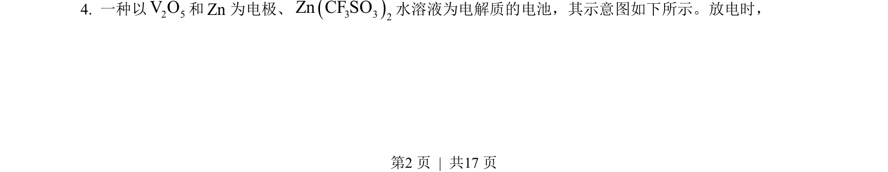
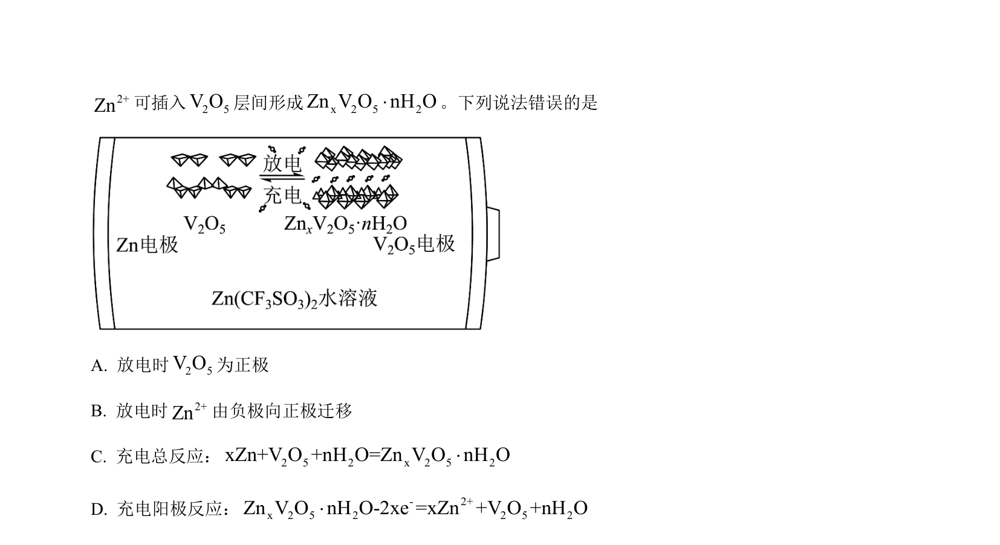
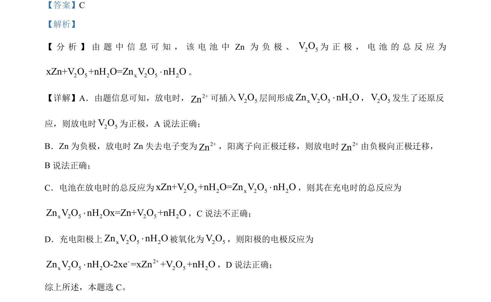

## 题面

## 摘要

考查锌-氧化钒水系电池的充放电原理及电极反应、离子迁移方向的判断。

## 关联考点

- [[287-原电池|原电池]]
- [[368-电解池|电解池]]
- [[电极反应]]
- [[离子迁移]]

## 答案与解析

> 📄 原 PDF 第 2 页：`素材/真题/吉林/2008-2024·（吉林）化学高考真题/2023年高考化学试卷（新课标）（解析卷）.pdf`
