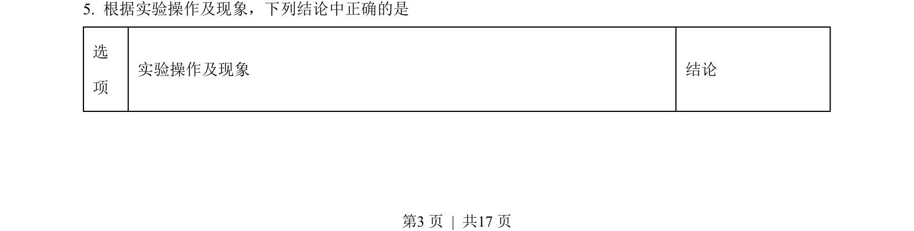
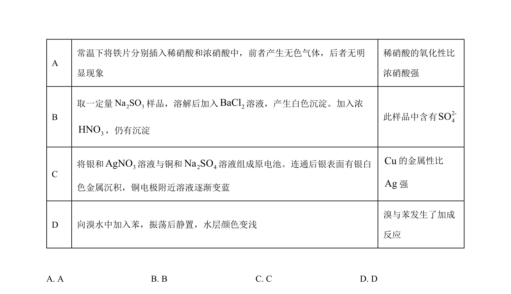
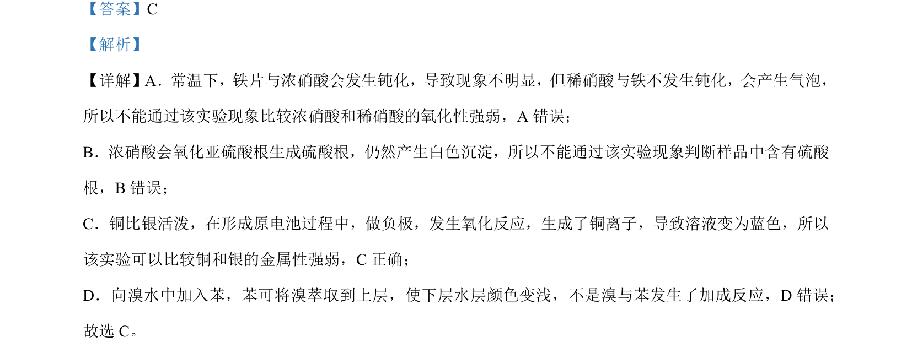

## 题面

## 摘要

浓稀硝酸氧化性比较、离子检验、原电池、萃取等实验现象分析

## 关联考点

- [[731-氧化性|氧化性]]
- [[860-钝化|钝化]]
- [[287-原电池|原电池]]
- [[832-萃取|萃取]]

## 答案与解析

> 📄 原 PDF 第 3 页：`素材/真题/吉林/2008-2024·（吉林）化学高考真题/2023年高考化学试卷（新课标）（解析卷）.pdf`
