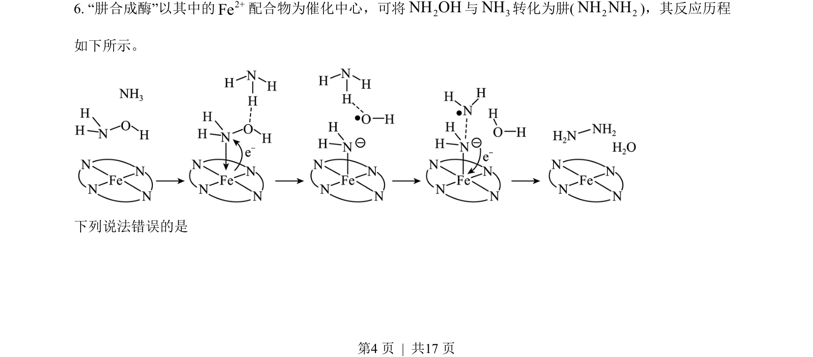
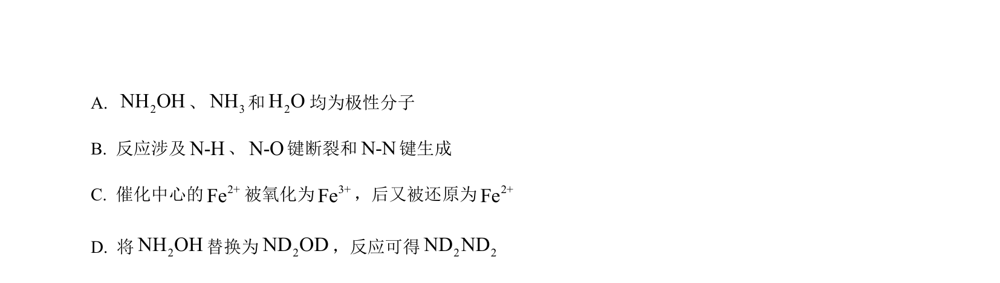
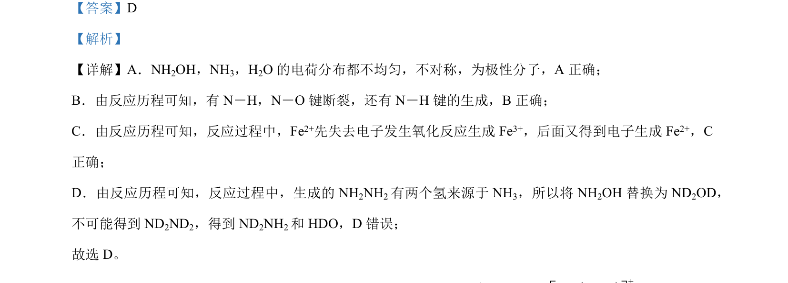

## 题面

## 摘要

本题通过反应历程分析分子极性、化学键变化及同位素取代产物正误判断。

## 关联考点

- [[870-极性分子判断|极性分子判断]]
- [[631-化学键断裂与生成|化学键断裂与生成]]
- [[162-氧化还原反应|氧化还原反应]]
- [[880-同位素效应|同位素效应]]

## 答案与解析

> 📄 原 PDF 第 4 页：`素材/真题/吉林/2008-2024·（吉林）化学高考真题/2023年高考化学试卷（新课标）（解析卷）.pdf`
