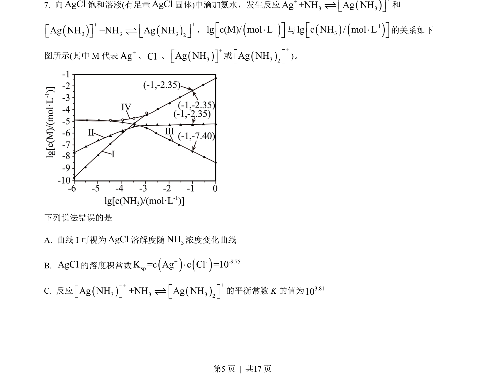
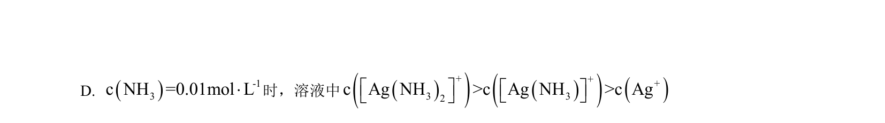
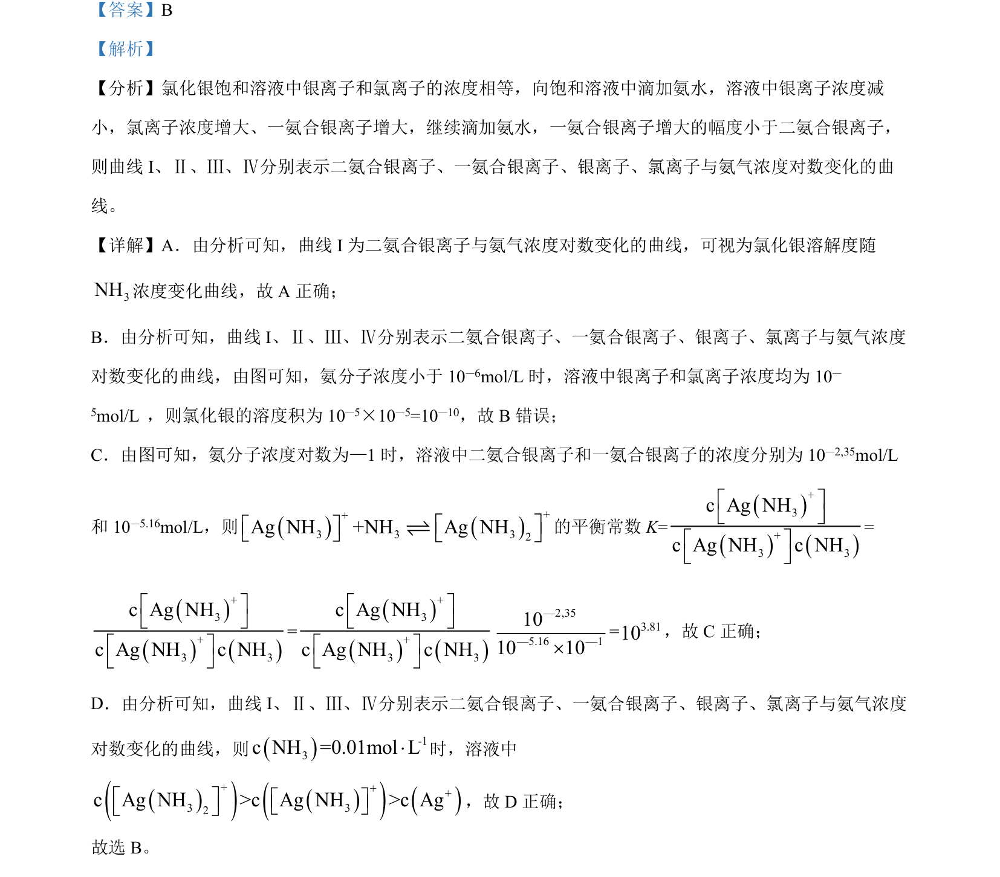

## 题面

## 摘要

考查AgCl与氨水反应的沉淀溶解平衡及配合平衡，通过图像分析离子浓度关系和平衡常数计算。

## 关联考点

- [[328-沉淀溶解平衡|沉淀溶解平衡]]
- [[846-配合平衡|配合平衡]]
- [[763-溶度积|溶度积常数]]
- [[342-化学平衡常数|平衡常数]]

## 答案与解析

> 📄 原 PDF 第 5 页：`素材/真题/吉林/2008-2024·（吉林）化学高考真题/2023年高考化学试卷（新课标）（解析卷）.pdf`
