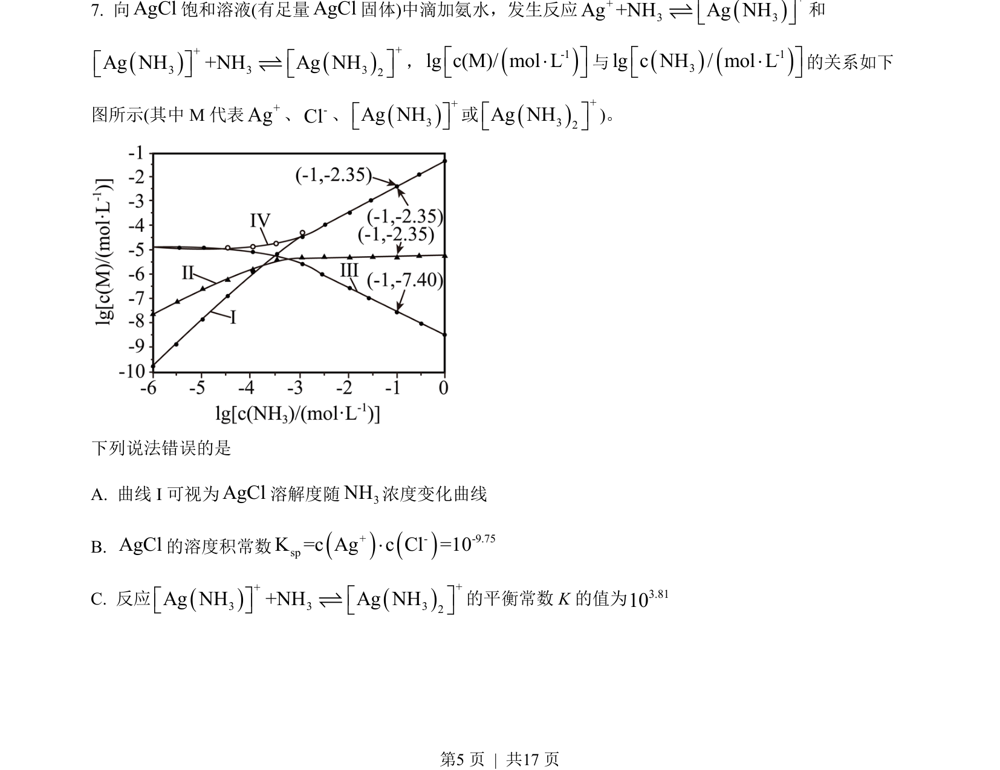
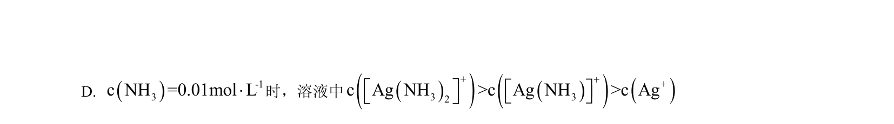
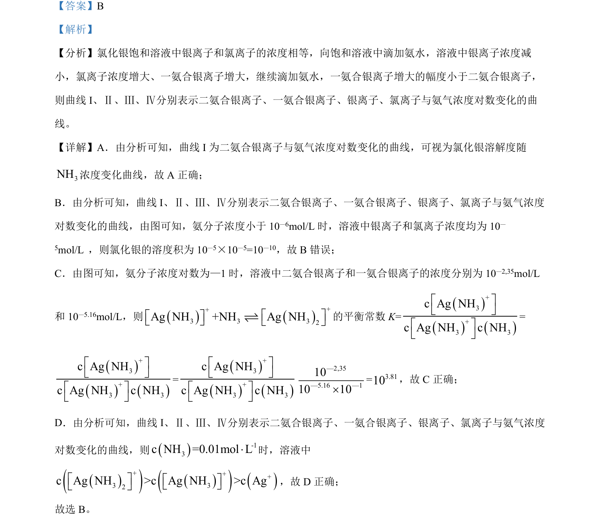

## 题面

## 摘要

考查AgCl与氨水反应的沉淀溶解平衡及配合平衡，通过图像分析离子浓度关系和平衡常数计算。

## 关联考点

- [[328-沉淀溶解平衡|沉淀溶解平衡]]
- [[845-配合平衡|配合平衡]]
- [[762-溶度积|溶度积常数]]
- [[342-化学平衡常数|平衡常数]]

## 答案与解析

> 📄 原 PDF 第 5 页：`素材/真题/吉林/2008-2024·（吉林）化学高考真题/2023年高考化学试卷（新课标）（解析卷）.pdf`

<!-- 题干文本-start -->
## 题干文本
7. 向AgCl饱和溶液(有足量AgCl固体)中滴加氨水，发生反应 ()++3 3Ag +NH Ag NHé ùë ûƒ和
()()++3 3 32Ag NH +NH Ag NHé ùé ùë ûë ûƒ，()-1lg c(M)/ mol Lé ù×ë û与()()-13lg c NH / mol Lé ù×ë û的关系如下
图所示(其中 M 代表+Ag、-Cl、()+3Ag NHé ùë û或()+32Ag NHé ùë û)。
  
下列说法错误的是
A. 曲线 I 可视为AgCl溶解度随3NH浓度变化曲线
B. AgCl的溶度积常数()()+ - -9.75spK =c Ag c Cl =10×
C. 反应()()++3 3 32Ag NH +NH Ag NHé ùé ùë ûë ûƒ的平衡常数 K的值为3.8110
<!-- 题干文本-end -->

<!-- 解析文本-start -->
## 解析文本

<!-- 解析文本-end -->
