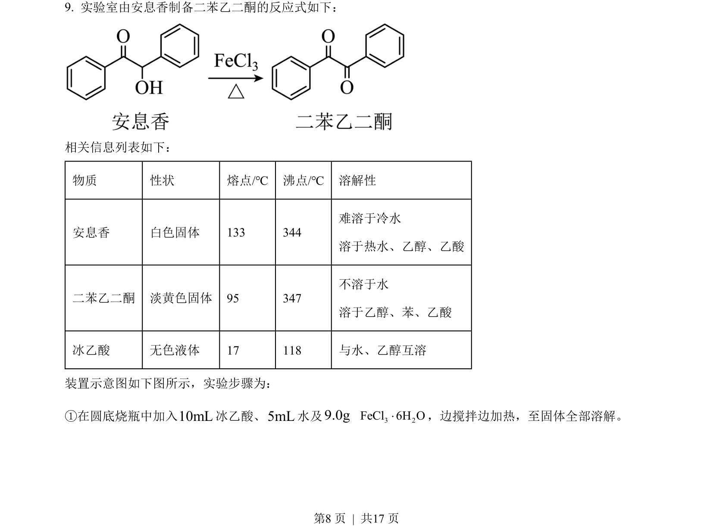
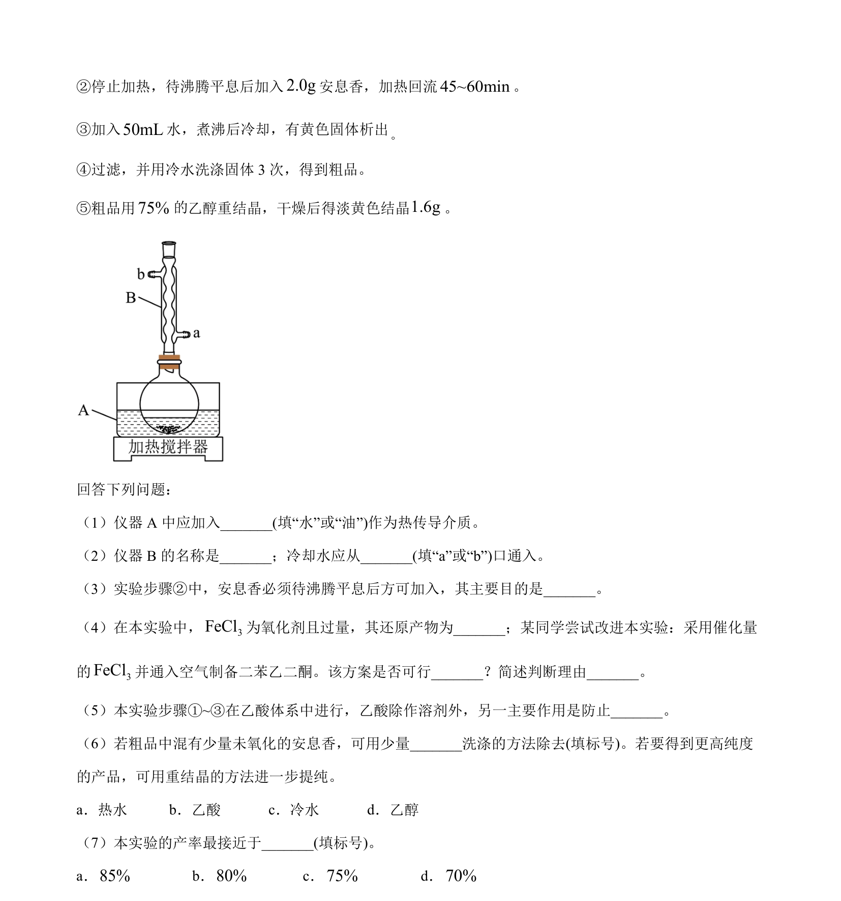
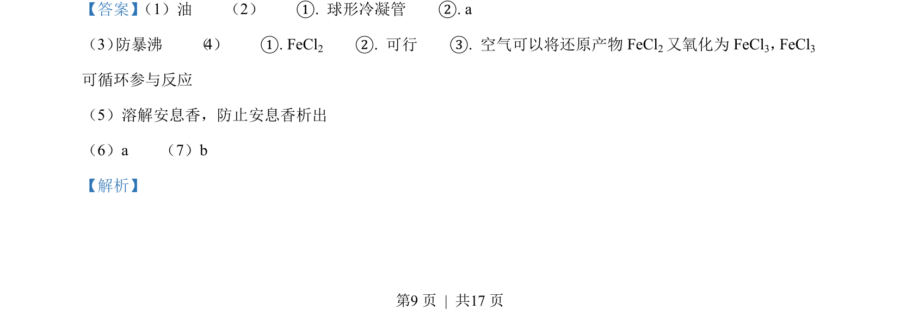
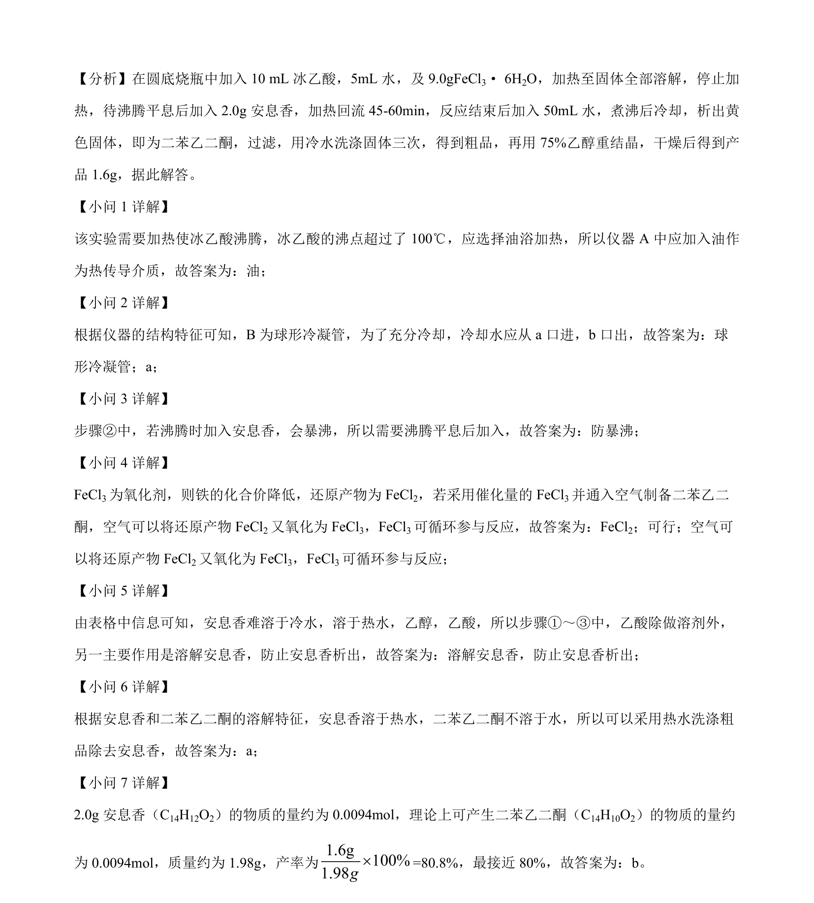

## 题面

## 摘要

实验室安息香氧化制备二苯乙二酮的反应条件与操作流程

## 关联考点

- [[271-化学合成|有机合成]]
- [[773-物质分离提纯|物质分离提纯]]
- [[580-实验操作|实验操作]]

## 答案与解析

> 📄 原 PDF 第 8 页：`素材/真题/吉林/2008-2024·（吉林）化学高考真题/2023年高考化学试卷（新课标）（解析卷）.pdf`

<!-- 题干文本-start -->
## 题干文本
9. 实验室由安息香制备二苯乙二酮的反应式如下：
相关信息列表如下：
物质 性状 熔点/℃ 沸点/℃ 溶解性
安息香 白色固体 133 344
难溶于冷水
溶于热水、乙醇、乙酸
二苯乙二酮 淡黄色固体 95 347
不溶于水
溶于乙醇、苯、乙酸
冰乙酸 无色液体 17 118 与水、乙醇互溶
装置示意图如下图所示，实验步骤为：
①在圆底烧瓶中加入10mL冰乙酸、5mL水及9.0g 3 2FeCl 6H O×，边搅拌边加热，至固体全部溶解。
<!-- 题干文本-end -->

<!-- 解析文本-start -->
## 解析文本

<!-- 解析文本-end -->
