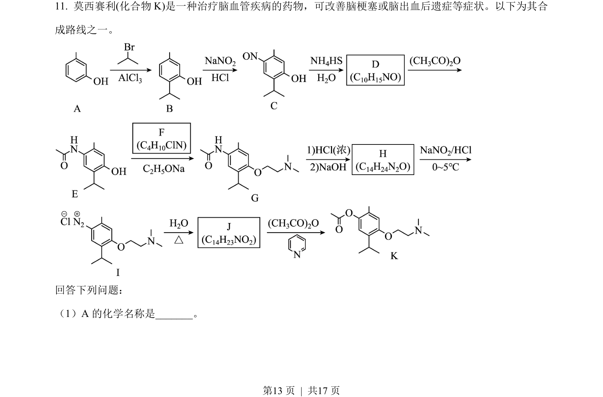
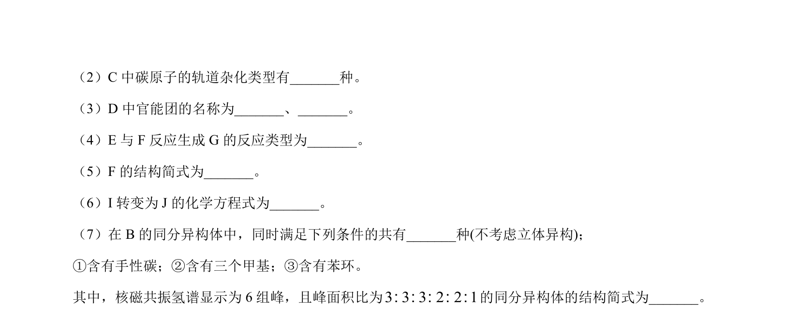
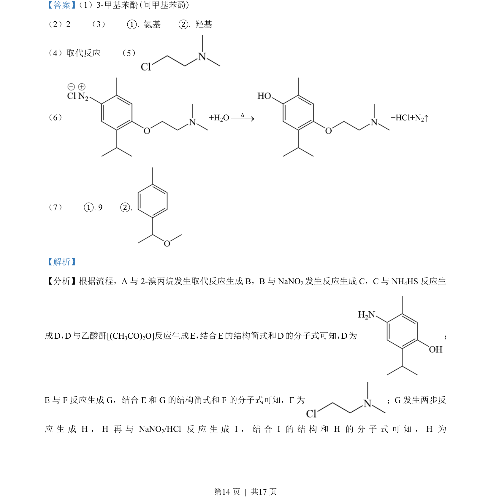
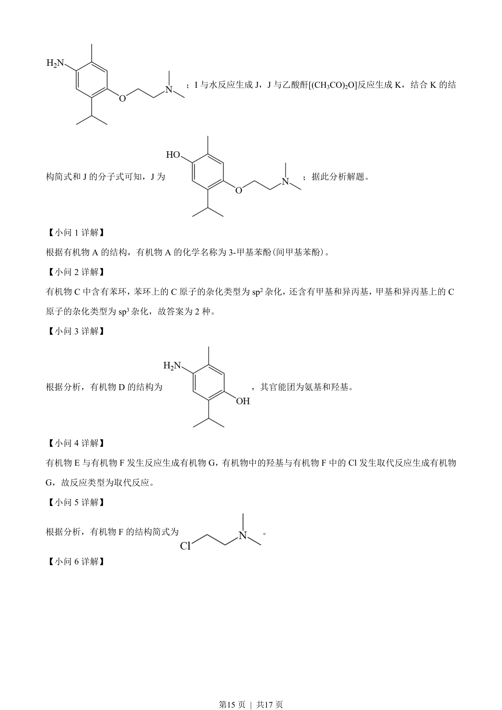
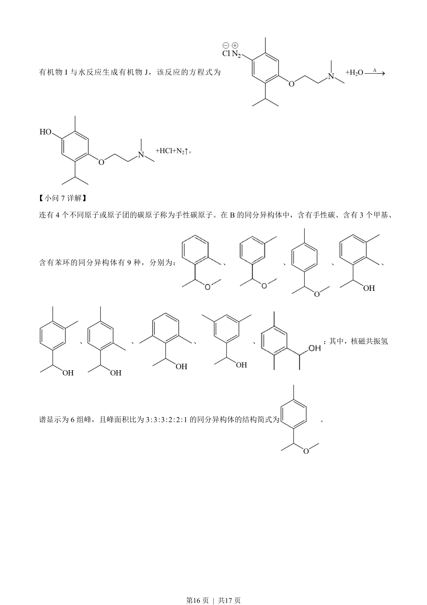

## 题面

## 摘要

有机合成与推断，涉及结构简式、反应类型、同分异构体书写及数目判断。

## 关联考点

- [[709-有机合成推断|有机合成推断]]
- [[446-同分异构体|同分异构体]]
- [[646-反应类型|反应类型]]
- [[817-结构简式|结构简式]]

## 答案与解析

> 📄 原 PDF 第 13 页：`素材/真题/吉林/2008-2024·（吉林）化学高考真题/2023年高考化学试卷（新课标）（解析卷）.pdf`
