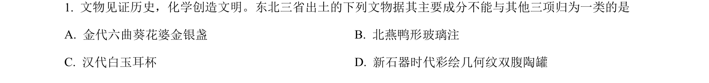
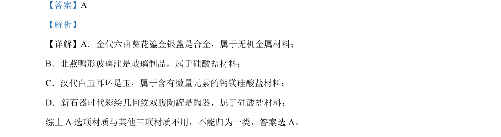

## 题面

## 摘要

该题考查依据材质对古代文物进行分类，识别金属材料与硅酸盐材料。

## 关联考点

- [[696-无机非金属材料|无机非金属材料]]
- [[868-硅酸盐材料|硅酸盐材料]]
- [[857-金属材料|金属材料]]

## 答案与解析

> 📄 原 PDF 第 1 页：`素材/真题/吉林/2008-2024·（吉林）化学高考真题/2024年高考化学试卷（辽宁）（解析卷）.pdf`
