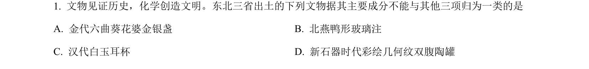
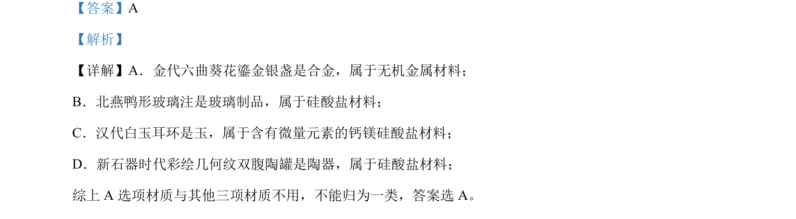

## 题面

## 摘要

该题考查依据材质对古代文物进行分类，识别金属材料与硅酸盐材料。

## 关联考点

- [[696-无机非金属材料|无机非金属材料]]
- [[868-硅酸盐材料|硅酸盐材料]]
- [[857-金属材料|金属材料]]

## 答案与解析

> 📄 原 PDF 第 1 页：`素材/真题/吉林/2008-2024·（吉林）化学高考真题/2024年高考化学试卷（辽宁）（解析卷）.pdf`

<!-- 题干文本-start -->
## 题干文本
1. 文物见证历史，化学创造文明。东北三省出土的下列文物据其主要成分不能与其他三项归为一类的是
A. 金代六曲葵花婆金银盏 B. 北燕鸭形玻璃注
C. 汉代白玉耳杯 D. 新石器时代彩绘几何纹双腹陶罐
<!-- 题干文本-end -->

<!-- 解析文本-start -->
## 解析文本
【答案】A
【解析】
【详解】A．金代六曲葵花鎏金银盏是合金，属于无机金属材料；
B．北燕鸭形玻璃注是玻璃制品，属于硅酸盐材料；
C．汉代白玉耳环是玉，属于含有微量元素的钙镁硅酸盐材料；
D．新石器时代彩绘几何纹双腹陶罐是陶器，属于硅酸盐材料；
综上 A 选项材质与其他三项材质不用，不能归为一类，答案选 A。
<!-- 解析文本-end -->
