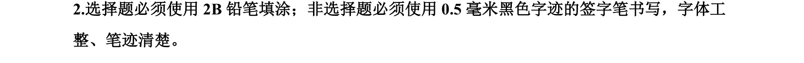

## 题面

## 摘要

考查原子核素表示、晶体类型、共价键形成及分子空间构型等基础概念。

## 关联考点

- [[265-核素|核素]]
- [[411-晶体类型|晶体类型]]
- [[255-共价键|共价键]]
- [[VSEPR模型]]

## 答案与解析

> 📄 原 PDF 第 1 页：`素材/真题/吉林/2008-2024·（吉林）化学高考真题/2024年高考化学试卷（辽宁）（解析卷）.pdf`
