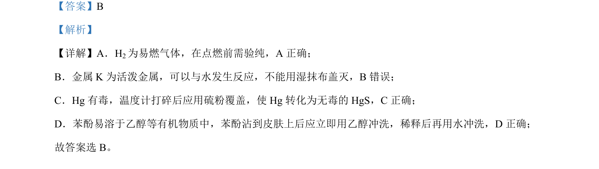

## 题面

## 摘要

化学实验安全操作，判断关于易燃气体、活泼金属、有毒物质和苯酚处理的正确做法

## 关联考点

- [[611-化学实验安全|化学实验安全]]
- [[775-物质性质与处理|物质性质与处理]]

## 答案与解析

> 📄 原 PDF 第 2 页：`素材/真题/吉林/2008-2024·（吉林）化学高考真题/2024年高考化学试卷（辽宁）（解析卷）.pdf`

<!-- 题干文本-start -->
## 题干文本
3. 下列实验操作或处理方法错误的是
A. 点燃2H前，先检验其纯度 B. 金属 K 着火，用湿抹布盖灭
C. 温度计中水银洒落地面，用硫粉处理 D. 苯酚沾到皮肤上，先后用乙醇、水冲洗
<!-- 题干文本-end -->

<!-- 解析文本-start -->
## 解析文本
【答案】B
【解析】
【详解】A．H2为易燃气体，在点燃前需验纯，A 正确；
B．金属 K 为活泼金属，可以与水发生反应，不能用湿抹布盖灭，B错误；
C．Hg 有毒，温度计打碎后应用硫粉覆盖，使 Hg 转化为无毒的 HgS，C正确；
D．苯酚易溶于乙醇等有机物质中，苯酚沾到皮肤上后应立即用乙醇冲洗，稀释后再用水冲洗，D 正确；
故答案选 B。
<!-- 解析文本-end -->
