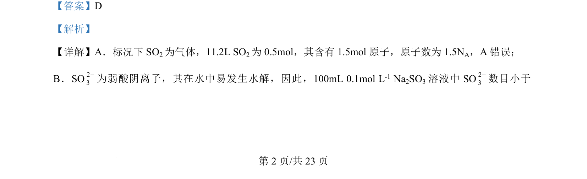
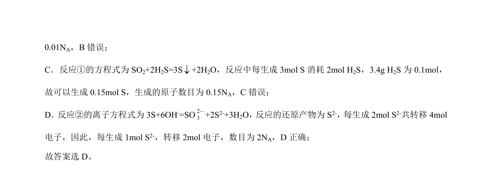

## 题面

## 摘要

考查阿伏加德罗常数相关计算，涉及气体摩尔体积、盐类水解及氧化还原转移电子数。

## 关联考点

- [[450-阿伏伽德罗常数|阿伏加德罗常数]]
- [[气体摩尔体积]]
- [[336-盐类水解|盐类水解]]
- [[162-氧化还原反应|氧化还原反应]]

## 答案与解析

> 📄 原 PDF 第 2 页：`素材/真题/吉林/2008-2024·（吉林）化学高考真题/2024年高考化学试卷（辽宁）（解析卷）.pdf`
