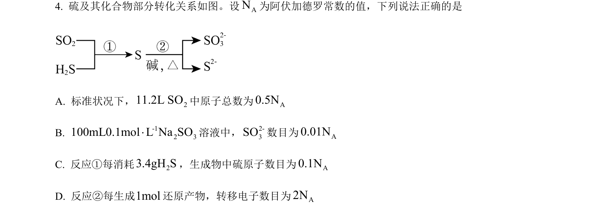
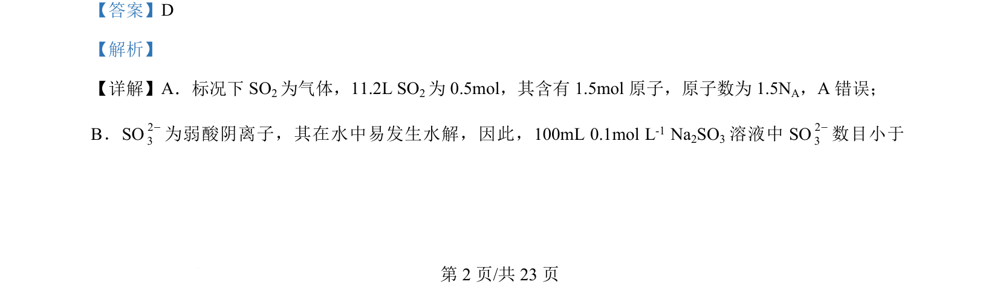
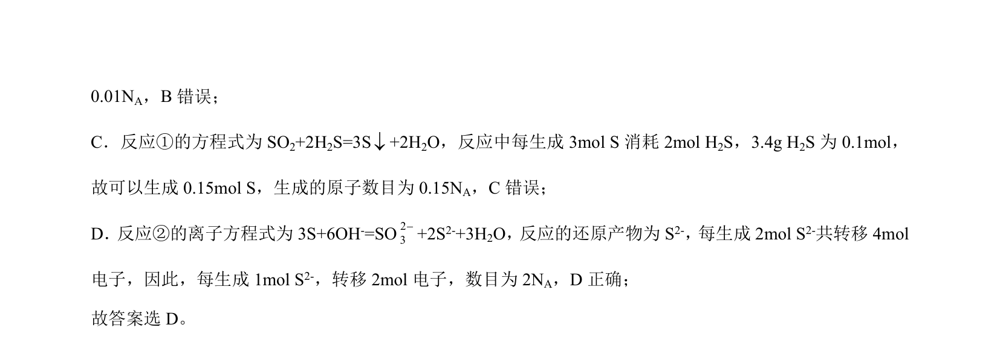

## 题面

## 摘要

考查阿伏加德罗常数相关计算，涉及气体摩尔体积、盐类水解及氧化还原转移电子数。

## 关联考点

- [[450-阿伏伽德罗常数|阿伏加德罗常数]]
- [[727-气体摩尔体积|气体摩尔体积]]
- [[336-盐类水解|盐类水解]]
- [[162-氧化还原反应|氧化还原反应]]

## 答案与解析

> 📄 原 PDF 第 2 页：`素材/真题/吉林/2008-2024·（吉林）化学高考真题/2024年高考化学试卷（辽宁）（解析卷）.pdf`

<!-- 题干文本-start -->
## 题干文本
4. 硫及其化合物部分转化关系如图。设AN为阿伏加德罗常数的值，下列说法正确的是
A. 标准状况下， 211.2L SO中原子总数为A0.5N
B. -12 3100mL0.1mol L Na SO×溶液中，2-3SO数目为 A0.01N
C. 反应①每消耗 23.4gH S，生成物中硫原子数目为A0.1N
D. 反应②每生成1mol还原产物，转移电子数目为A2N
<!-- 题干文本-end -->

<!-- 解析文本-start -->
## 解析文本
【答案】D
【解析】
【详解】A．标况下 SO2为气体，11.2L SO2为 0.5mol，其含有 1.5mol原子，原子数为 1.5NA，A 错误；
B．SO23-为弱酸阴离子，其在水中易发生水解，因此， 100mL 0.1mol L -1 Na2SO3溶液中 SO23-数目小于
为
<!-- 解析文本-end -->
