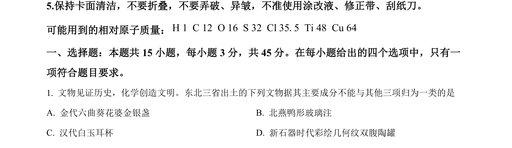
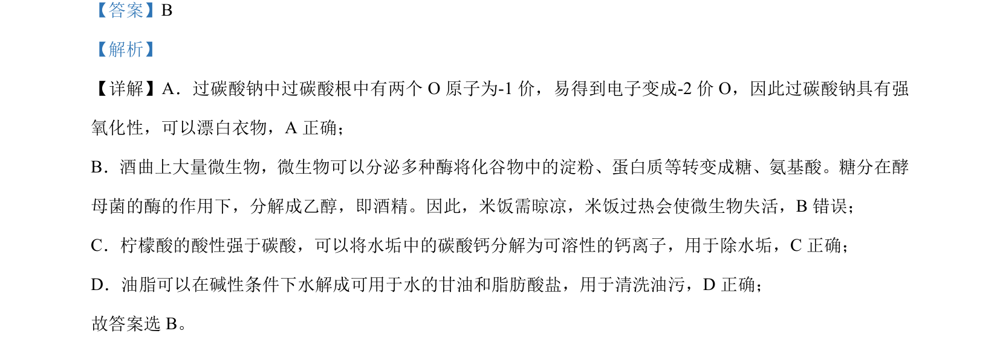

## 题面

## 摘要

本题考查化学与生活知识，涉及漂白、发酵、除垢、去油等原理的判断。

## 关联考点

- [[162-氧化还原反应|氧化还原反应]]
- [[852-酸性比较|酸性比较]]
- [[748-油脂水解|油脂水解]]
- [[688-微生物活性|微生物活性]]

## 答案与解析

> 📄 原 PDF 第 3 页：`素材/真题/吉林/2008-2024·（吉林）化学高考真题/2024年高考化学试卷（辽宁）（解析卷）.pdf`
