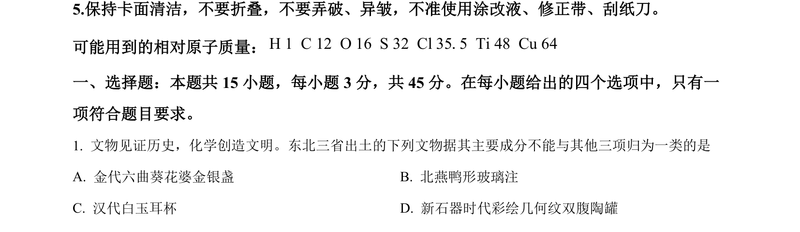
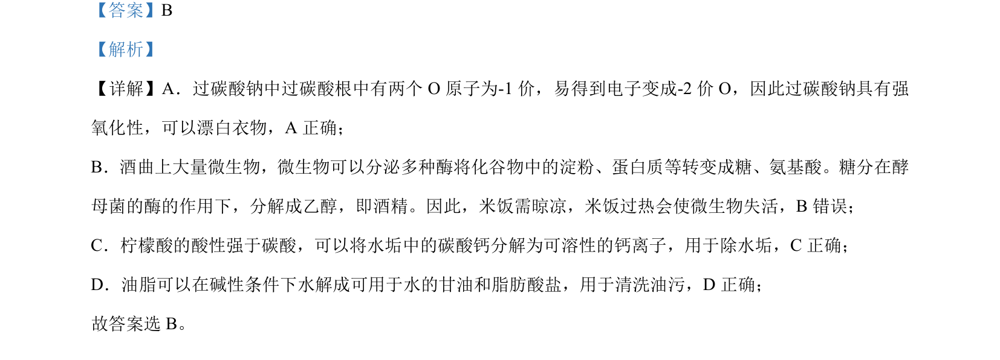

## 题面

## 摘要

本题考查化学与生活知识，涉及漂白、发酵、除垢、去油等原理的判断。

## 关联考点

- [[162-氧化还原反应|氧化还原反应]]
- [[852-酸性比较|酸性比较]]
- [[748-油脂水解|油脂水解]]
- [[688-微生物活性|微生物活性]]

## 答案与解析

> 📄 原 PDF 第 3 页：`素材/真题/吉林/2008-2024·（吉林）化学高考真题/2024年高考化学试卷（辽宁）（解析卷）.pdf`

<!-- 题干文本-start -->
## 题干文本
5. 家务劳动中蕴含着丰富的化学知识。下列相关解释错误的是
A. 用过氧碳酸钠漂白衣物：2 4Na CO具有较强氧化性
B. 酿米酒需晾凉米饭后加酒曲：乙醇受热易挥发
C. 用柠檬酸去除水垢：柠檬酸酸性强于碳酸
D. 用碱液清洗厨房油污：油脂可碱性水解
<!-- 题干文本-end -->

<!-- 解析文本-start -->
## 解析文本
【答案】B
【解析】
【详解】A．过碳酸钠中过碳酸根中有两个 O 原子为-1 价，易得到电子变成-2 价 O，因此过碳酸钠具有强
氧化性，可以漂白衣物，A 正确；
B．酒曲上大量微生物，微生物可以分泌多种酶将化谷物中的淀粉、蛋白质等转变成糖、氨基酸。糖分在酵
母菌的酶的作用下，分解成乙醇，即酒精。因此，米饭需晾凉，米饭过热会使微生物失活，B错误；
C．柠檬酸的酸性强于碳酸，可以将水垢中的碳酸钙分解为可溶性的钙离子，用于除水垢，C正确；
D．油脂可以在碱性条件下水解成可用于水的甘油和脂肪酸盐，用于清洗油污，D 正确；
故答案选 B。
<!-- 解析文本-end -->
