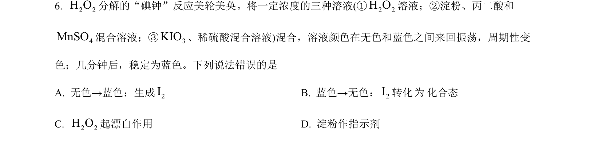
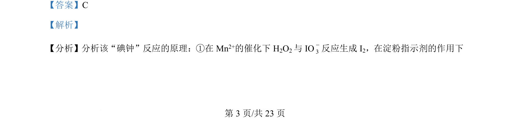
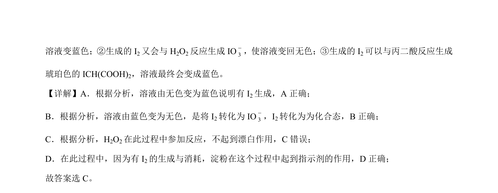

## 题面

## 摘要

本题通过“碘钟”反应考查反应物与生成物判断及淀粉指示剂作用。

## 关联考点

- [[162-氧化还原反应|氧化还原反应]]
- [[801-碘单质的生成与消耗|碘单质的生成与消耗]]
- [[150-酸碱指示剂|指示剂]]

## 答案与解析

> 📄 原 PDF 第 3 页：`素材/真题/吉林/2008-2024·（吉林）化学高考真题/2024年高考化学试卷（辽宁）（解析卷）.pdf`
