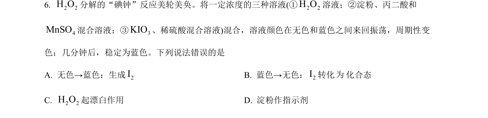
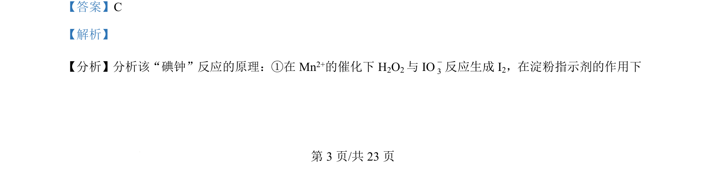
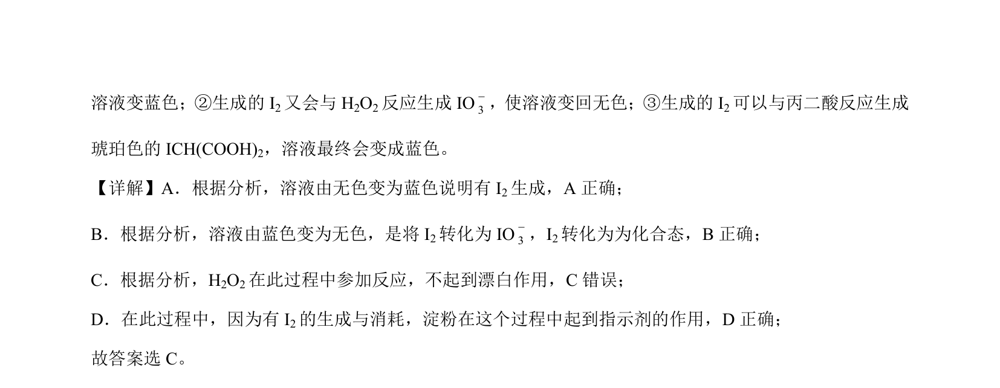

## 题面

## 摘要

本题通过“碘钟”反应考查反应物与生成物判断及淀粉指示剂作用。

## 关联考点

- [[162-氧化还原反应|氧化还原反应]]
- [[800-碘单质的生成与消耗|碘单质的生成与消耗]]
- [[150-酸碱指示剂|指示剂]]

## 答案与解析

> 📄 原 PDF 第 3 页：`素材/真题/吉林/2008-2024·（吉林）化学高考真题/2024年高考化学试卷（辽宁）（解析卷）.pdf`

<!-- 题干文本-start -->
## 题干文本
6. 2 2H O分解的“碘钟”反应美轮美奂。将一定浓度的三种溶液(①2 2H O溶液；②淀粉、丙二酸和
4MnSO混合溶液；③3KIO、稀硫酸混合溶液)混合，溶液颜色在无色和蓝色之间来回振荡，周期性变
色；几分钟后，稳定为蓝色。下列说法错误的是
A. 无色→蓝色：生成2I B. 蓝色→无色：2I转化 化合态
C. 2 2H O起漂白作用 D. 淀粉作指示剂
<!-- 题干文本-end -->

<!-- 解析文本-start -->
## 解析文本
【答案】C
【解析】
【分析】分析该“碘钟”反应的原理：①在Mn2+的催化下 H2O2与 IO3-反应生成 I2，在淀粉指示剂的作用下
为
<!-- 解析文本-end -->
