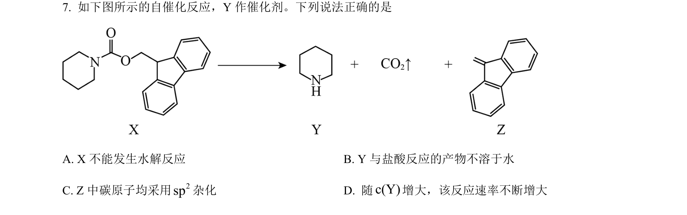
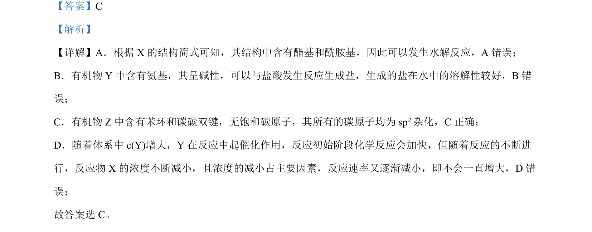

## 题面

## 摘要

本题通过有机物结构与性质选项判断，考查官能团水解、酸碱性、碳原子杂化及反应速率影响因素。

## 关联考点

- [[448-官能团|官能团]]
- [[743-水解反应|水解反应]]
- [[720-杂化方式|杂化方式]]
- [[283-化学反应速率|反应速率]]

## 答案与解析

> 📄 原 PDF 第 4 页：`素材/真题/吉林/2008-2024·（吉林）化学高考真题/2024年高考化学试卷（辽宁）（解析卷）.pdf`
