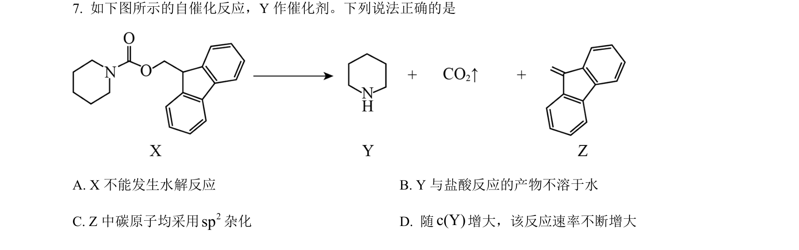
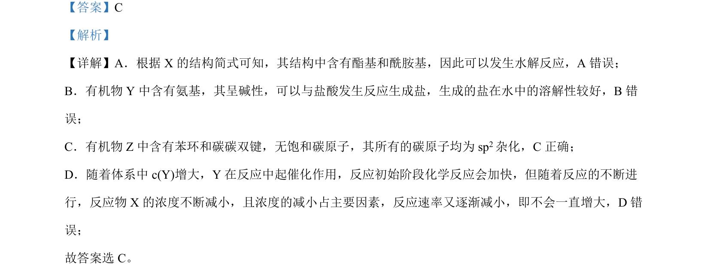

## 题面

## 摘要

本题通过有机物结构与性质选项判断，考查官能团水解、酸碱性、碳原子杂化及反应速率影响因素。

## 关联考点

- [[448-官能团|官能团]]
- [[742-水解反应|水解反应]]
- [[719-杂化方式|杂化方式]]
- [[283-化学反应速率|反应速率]]

## 答案与解析

> 📄 原 PDF 第 4 页：`素材/真题/吉林/2008-2024·（吉林）化学高考真题/2024年高考化学试卷（辽宁）（解析卷）.pdf`

<!-- 题干文本-start -->
## 题干文本
7. 如下图所示的自催化反应，Y 作催化剂。下列说法正确的是
A. X 不能发生水解反应 B. Y 与盐酸反应的产物不溶于水
C. Z中碳原子均采用2sp杂化 D. 随c(Y)增大，该反应速率不断增大
<!-- 题干文本-end -->

<!-- 解析文本-start -->
## 解析文本
【答案】C
【解析】
【详解】A．根据 X 的结构简式可知，其结构中含有酯基和酰胺基，因此可以发生水解反应，A 错误；
B．有机物 Y 中含有氨基，其呈碱性，可以与盐酸发生反应生成盐，生成的盐在水中的溶解性较好，B错
误；
C．有机物 Z中含有苯环和碳碳双键，无饱和碳原子，其所有的碳原子均为 sp2杂化，C正确；
D．随着体系中 c(Y)增大，Y 在反应中起催化作用，反应初始阶段化学反应会加快，但随着反应的不断进
行，反应物 X 的浓度不断减小，且浓度的减小占主要因素，反应速率又逐渐减小，即不会一直增大，D 错
误；
故答案选 C。
<!-- 解析文本-end -->
