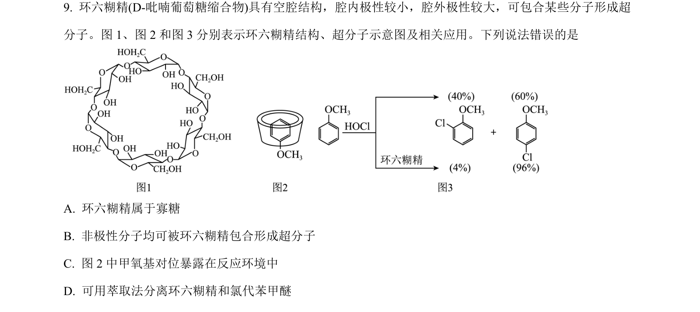
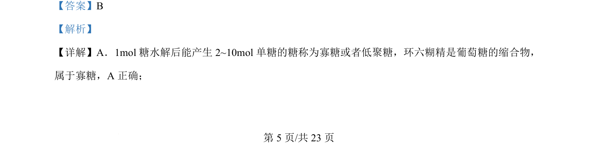
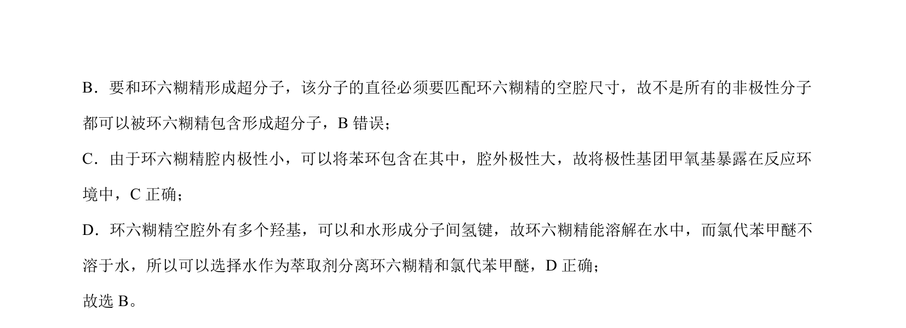

## 题面

## 摘要

本题考查环六糊精的结构与性质，涉及寡糖定义、超分子形成条件及溶解性判断。

## 关联考点

- [[675-寡糖|寡糖]]
- [[842-超分子|超分子]]
- [[721-极性|极性]]
- [[435-氢键|氢键]]

## 答案与解析

> 📄 原 PDF 第 5 页：`素材/真题/吉林/2008-2024·（吉林）化学高考真题/2024年高考化学试卷（辽宁）（解析卷）.pdf`
