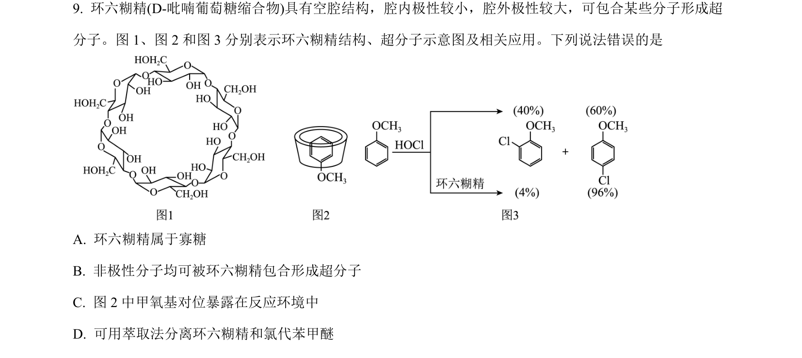
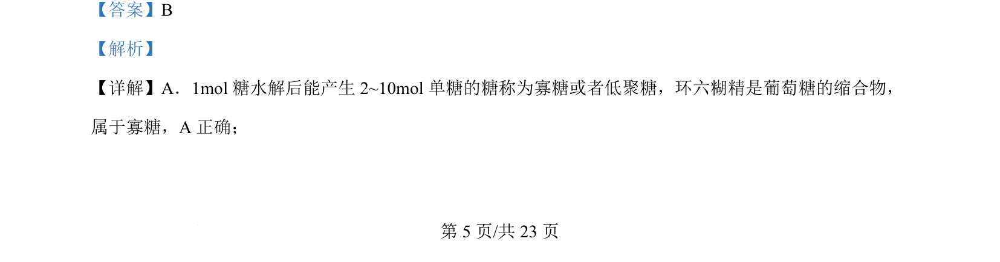
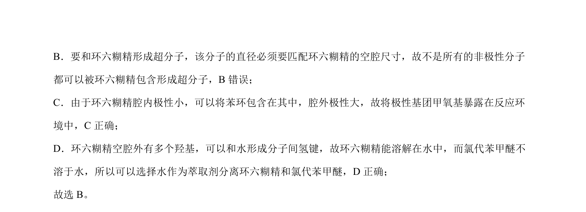

## 题面

## 摘要

本题考查环六糊精的结构与性质，涉及寡糖定义、超分子形成条件及溶解性判断。

## 关联考点

- [[675-寡糖|寡糖]]
- [[842-超分子|超分子]]
- [[721-极性|极性]]
- [[435-氢键|氢键]]

## 答案与解析

> 📄 原 PDF 第 5 页：`素材/真题/吉林/2008-2024·（吉林）化学高考真题/2024年高考化学试卷（辽宁）（解析卷）.pdf`

<!-- 题干文本-start -->
## 题干文本
9. 环六糊精(D-吡喃葡萄糖缩合物)具有空腔结构，腔内极性较小，腔外极性较大，可包合某些分子形成超
分子。图 1、图 2 和图 3 分别表示环六糊精结构、超分子示意图及相关应用。下列说法错误的是
A. 环六糊精属于寡糖
B. 非极性分子均可被环六糊精包合形成超分子
C. 图 2中甲氧基对位暴露在反应环境中
D. 可用萃取法分离环六糊精和氯代苯甲醚
<!-- 题干文本-end -->

<!-- 解析文本-start -->
## 解析文本
【答案】B
【解析】
【详解】A．1mol糖水解后能产生 2~10mol单糖的糖称为寡糖或者低聚糖，环六糊精是葡萄糖的缩合物，
属于寡糖，A 正确；
的
<!-- 解析文本-end -->
