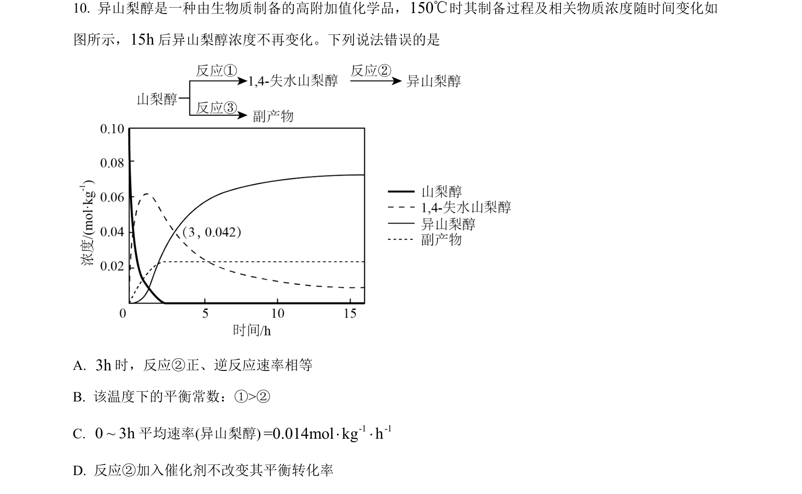
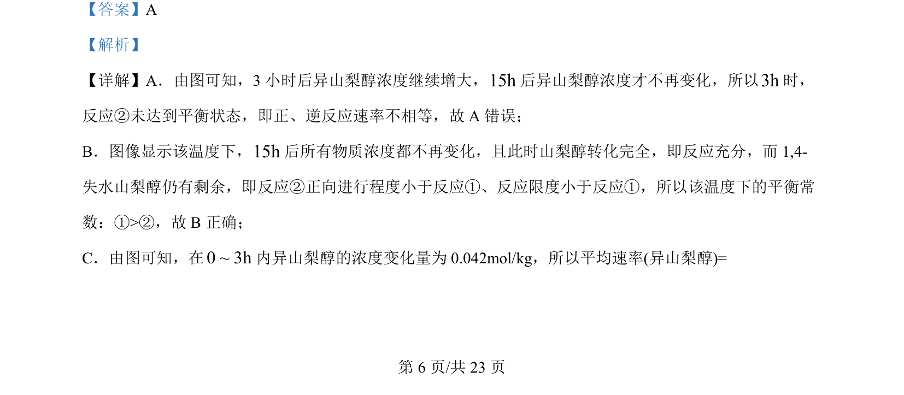
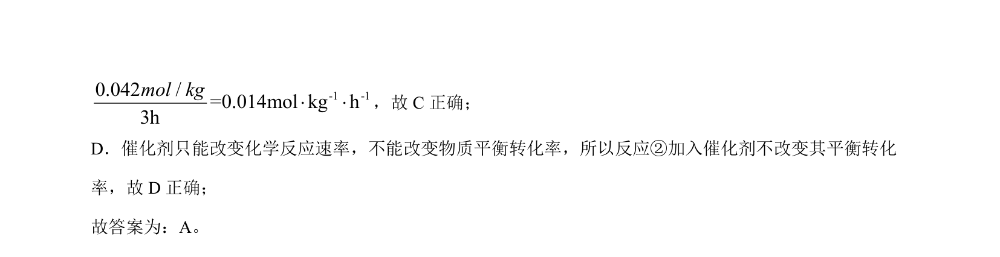

## 题面

## 摘要

该题通过浓度随时间变化曲线考查化学反应速率、平衡状态判断及影响因素。

## 关联考点

- [[283-化学反应速率|化学反应速率]]
- [[284-化学平衡|化学平衡]]
- [[039-催化剂|催化剂]]

## 答案与解析

> 📄 原 PDF 第 6 页：`素材/真题/吉林/2008-2024·（吉林）化学高考真题/2024年高考化学试卷（辽宁）（解析卷）.pdf`
