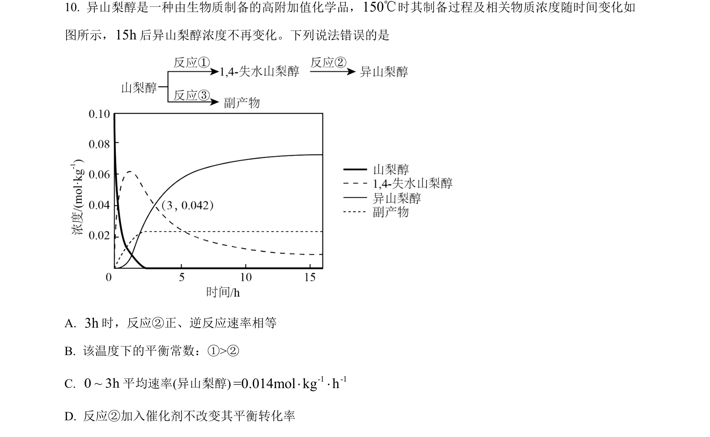
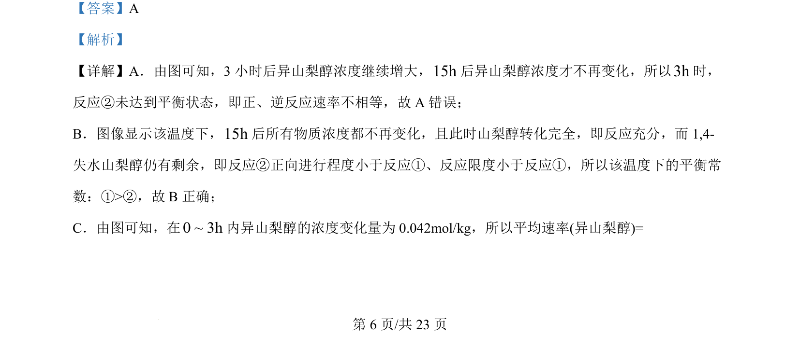
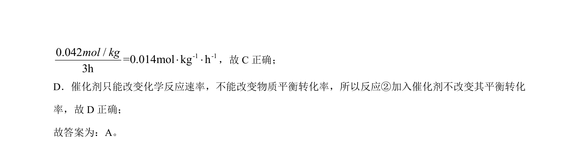

## 题面

## 摘要

该题通过浓度随时间变化曲线考查化学反应速率、平衡状态判断及影响因素。

## 关联考点

- [[283-化学反应速率|化学反应速率]]
- [[284-化学平衡|化学平衡]]
- [[039-催化剂|催化剂]]

## 答案与解析

> 📄 原 PDF 第 6 页：`素材/真题/吉林/2008-2024·（吉林）化学高考真题/2024年高考化学试卷（辽宁）（解析卷）.pdf`

<!-- 题干文本-start -->
## 题干文本
10. 异山梨醇是一种由生物质制备的高附加值化学品，150℃时其制备过程及相关物质浓度随时间变化如
图所示，15h后异山梨醇浓度不再变化。下列说法错误的是
A. 3h时，反应②正、逆反应速率相等
B. 该温度下的平衡常数：①>②
C. 0 ~ 3h平均速率(异山梨醇) -1 -1=0.014mol kg h× ×
D. 反应②加入催化剂不改变其平衡转化率
<!-- 题干文本-end -->

<!-- 解析文本-start -->
## 解析文本
【答案】A
【解析】
【详解】A．由图可知，3 小时后异山梨醇浓度继续增大，15h后异山梨醇浓度才不再变化，所以3h时，
反应②未达到平衡状态，即正、逆反应速率不相等，故 A 错误；
B．图像显示该温度下，15h后所有物质浓度都不再变化，且此时山梨醇转化完全，即反应充分，而 1,4-
失水山梨醇仍有剩余，即反应②正向进行程度小于反应①、反应限度小于反应①，所以该温度下的平衡常
数：①>②，故 B正确；
C．由图可知，在0 ~ 3h内异山梨醇的浓度变化量为 0.042mol/kg，所以平均速率(异山梨醇)=
<!-- 解析文本-end -->
